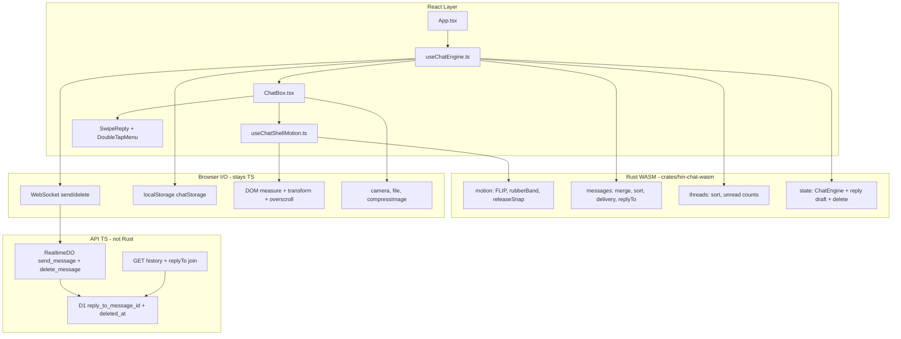
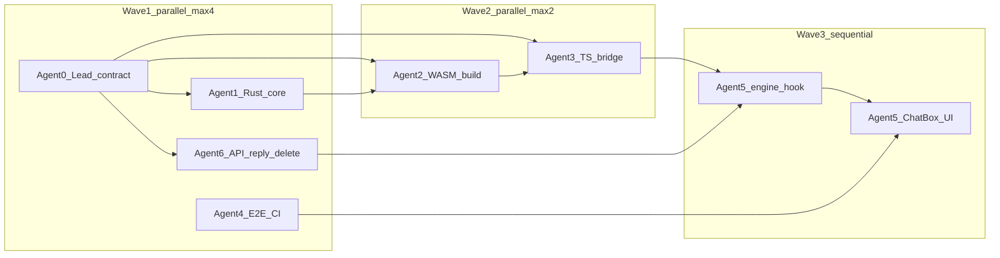

# ChatBox Rust WASM + Interaction Effects — Full Implementation Plan

## Context

The codebase has **no Rust/WASM today**. The chat feature is named **messages/chat/DM** and spans:

- UI: [`apps/web/src/components/messages/MessagesPanel.tsx`](apps/web/src/components/messages/MessagesPanel.tsx), [`FloatingActionStack.tsx`](apps/web/src/components/ui/FloatingActionStack.tsx)
- Overscroll (TS/DOM today): [`useOverscrollBounce.ts`](apps/web/src/hooks/useOverscrollBounce.ts)
- Engine helpers: [`chatMessages.ts`](apps/web/src/lib/chatMessages.ts), [`chatStorage.ts`](apps/web/src/lib/chatStorage.ts)
- Orchestration: [`App.tsx`](apps/web/src/App.tsx) (chat state + WS handlers inline)
- API: [`apps/api/src/durable-objects/realtime.ts`](apps/api/src/durable-objects/realtime.ts), [`apps/api/src/lib/messages.ts`](apps/api/src/lib/messages.ts)
- Note: `useChatShellMotion.ts` / `panelMorph.ts` are **planned** (not in tree yet); shell open uses CSS `animate-panel-pop-anchor`

**Goals:**
1. Extract **`ChatBox`** with WASM-backed motion + engine, thin React shell, exhaustive tests (original WASM plan).
2. Ship product interactions: **elastic rubber-band**, **swipe-to-reply** (DB + API + UI), **double-tap menu** (copy / retry / delete), **subtle open effects** for chatbox + conversation.



### Locked product behavior (interactions)

- **Rubber-band:** elastic bump at scroll ends on thread list + conversation (enhance [`useOverscrollBounce`](apps/web/src/hooks/useOverscrollBounce.ts); shell drag still uses WASM `rubber_band` / `release_snap`).
- **Swipe-to-reply:** swipe message → **highlighted quote bar above composer** (duplicate of that message); user types reply; persist `replyToMessageId` end-to-end.
- **Double-tap menu:** **Copy**, **Retry** (failed only), **Delete** (sender; soft-delete + broadcast).
- **Open chatbox:** subtler/springier panel + backdrop enter.
- **Open conversation:** list→thread transition + capped message stagger + composer enter.

---

## Phase 0 — Prerequisites and Design Decisions (10 items)

1. Add `rust-toolchain.toml` pinning stable Rust (e.g. `1.82+`) at repo root.
2. Document dev prerequisites in root README section: `rustup`, `wasm-pack`, `wasm32-unknown-unknown` target.
3. Confirm scope: **React renders DOM**; **WASM owns pure math + state transitions**; **no Workers-side Rust** in v1 (API stays TS).
4. Rename/extract conceptually: `MessagesPanel` → **`ChatBox`** (keep `MessagesPanel` as re-export alias during migration).
5. Define WASM boundary contract in `docs/chat-wasm-api.md` (Agent 0 deliverable — blocks parallel agents): JSON serde across boundary initially; optimize to typed structs in v2 if profiling demands.
6. Keep **TS fallback path** for Vitest (happy-dom), WASM load failure, and `prefers-reduced-motion`.
7. Add feature flag `VITE_CHAT_WASM=1` (default on in prod, off in tests unless explicitly enabled).
8. Add `.gitignore` entries: `crates/*/target/`, generated `apps/web/src/wasm/` (or commit generated pkg — pick one and document).
9. Verify production obfuscator ([`vite.config.ts`](apps/web/vite.config.ts)) does not break WASM imports — add build verification step.
10. Align types with [`packages/types/src/index.ts`](packages/types/src/index.ts) (`Message`, `MessageReplyTo`, `ChatThread`, `DeliveryStatus`, `ClientMessage`/`ServerMessage` including `delete_message` / `message_deleted`).

---

## Phase 1 — Rust Crate Architecture (18 items)

### Crate layout

```
crates/
  hin-chat-core/          # pure Rust, native unit tests, no wasm-bindgen
    src/
      lib.rs
      messages.rs         # port of chatMessages.ts
      motion.rs           # port of panelMorph.ts pure functions
      threads.rs          # thread list sort + unread aggregation
      state.rs            # ChatEngine state machine
      url.rs              # URL extraction for link preview drafts
  hin-chat-wasm/          # wasm-bindgen wrapper
    src/lib.rs            # exports to JS
    Cargo.toml            # depends on hin-chat-core
```

11. Create `hin-chat-core` with `#![deny(clippy::all)]` and `serde` + `serde_json` for Message structs.
12. Port `STATUS_RANK`, `deriveLocalStatus`, `mergeMessagePreferHigherStatus` to `messages.rs`.
13. Port `mergeAndSortMessages`, `applyDelivered`, `applyMessagesRead` to `messages.rs` — byte-for-byte parity with TS.
14. Port `invertFlip`, `invertFlipUniform`, `invertFlipCss`, `transformLayoutToTargetUniform` to `motion.rs`.
15. Port `rubberBand`, `releaseSnap` to `motion.rs` with identical default thresholds (320px, 0.5/0.36, 1.1/0.75).
16. Port `easeScrollTo` **easing function only** (`cubic ease-out: 1 - (1-t)^3`); JS applies scrollTop per frame.
17. Add `threads.rs`: sort threads by `lastMessage.createdAt` desc, tie-break username; compute unread badge from thread list.
18. Add `state.rs`: `ChatEngine` struct holding `messages`, `threads`, `active_recipient_id`, `unread_count`, `typing_users`, `applied_incoming_ids` (dedupe set), `replying_to_message_id` (optional).
19. Define engine events: `OpenPanel`, `ClosePanel`, `ToggleExpand`, `SelectRecipient`, `IncomingWsMessage`, `IncomingDelivered`, `IncomingRead`, `OptimisticSend` (with optional `reply_to`), `SendFailed`, `MarkSendingFailed`, `FetchHistoryMerge`, `TypingEvent`, `ClearTyping`, `SetReplyTo`, `ClearReplyTo`, `MessageDeleted`, `OptimisticDelete`.
20. Each event returns `EnginePatch { messages?, threads?, unread?, replying_to?, ... }` for React to apply. Merge must preserve `replyTo` / `replyToMessageId` on messages.
21. Add `url.rs`: extract first URL from text, strip trailing punctuation (mirror App.tsx regex logic).
22. Create `hin-chat-wasm` with `crate-type = ["cdylib"]`, `wasm-bindgen`, `console_error_panic_hook`.
23. Export WASM fns: `init`, `merge_and_sort_messages`, `apply_delivered`, `apply_messages_read`, `release_snap`, `rubber_band`, `invert_flip_uniform`, `sort_threads`, `engine_create`, `engine_dispatch`, `engine_snapshot`.
24. Use `#[wasm_bindgen(start)]` for panic hook setup.
25. Add `wee_alloc` or default allocator — benchmark bundle size; target < 150KB gzipped for chat WASM.
26. Generate TS types via `ts-rs` (optional v1.1) or hand-maintain `apps/web/src/wasm/chat.d.ts`.
27. Add `#[cfg(test)]` modules in `hin-chat-core` mirroring every TS test case.
28. Document: **DOM-coupled code never enters Rust** — only inputs/outputs as numbers and JSON.

---

## Phase 2 — Build Pipeline (12 items)

29. Add root script `"build:wasm": "wasm-pack build crates/hin-chat-wasm --target web --out-dir ../../apps/web/src/wasm/chat --release"`.
30. Chain: `"build": "npm run build:wasm && npm run build --workspaces --if-present"`.
31. Add `"dev:wasm": "cargo watch -x 'build --target wasm32-unknown-unknown'"` (optional hot rebuild).
32. Install Vite plugins in `apps/web`: `vite-plugin-wasm`, `vite-plugin-top-level-await`.
33. Update [`apps/web/vite.config.ts`](apps/web/vite.config.ts): add wasm + topLevelAwait **before** obfuscator plugin.
34. Add `apps/web/src/wasm/chatClient.ts` — lazy init wrapper with singleton `init()` promise.
35. Add `ensureChatWasm(): Promise<void>` called once at app boot (after login) or on first FAB click.
36. Add CI/dev script `scripts/verify-wasm-parity.sh` — runs Rust tests + TS parity tests.
37. Add root `"test:wasm": "cargo test -p hin-chat-core && cargo test -p hin-chat-wasm"`.
38. Pin `wasm-pack` version in docs; add `Makefile` or `justfile` target `just chat-wasm`.
39. Verify `tsc` includes generated `.d.ts` — add to `apps/web/tsconfig.json` if needed.
40. Production build smoke: `npm run build && npm run preview` — confirm WASM loads from `/assets/*.wasm`.

---

## Phase 3 — TypeScript Integration Layer (16 items)

41. Create [`apps/web/src/lib/chatWasmBridge.ts`](apps/web/src/lib/chatWasmBridge.ts) — unified API with auto-fallback to TS implementations.
42. Refactor [`chatMessages.ts`](apps/web/src/lib/chatMessages.ts) to delegate to WASM when ready; keep pure TS exports for fallback.
43. Refactor [`panelMorph.ts`](apps/web/src/lib/panelMorph.ts) similarly — WASM for math, TS for `measureRect` (DOM) and `prefersReducedMotion`.
44. Create [`apps/web/src/lib/chatEngine.ts`](apps/web/src/lib/chatEngine.ts) — TS adapter around WASM `ChatEngine` + React subscription pattern.
45. Preserve existing public function signatures so `App.tsx` migration is incremental.
46. Add `ChatEngineContext` (optional) or keep `useChatEngine` hook returning stable callbacks.
47. WASM JSON boundary: serialize `Message[]` with `JSON.stringify` / `parse` — validate with Zod from `@hin/types` on return.
48. Handle WASM init errors: log once, set `wasmAvailable = false`, continue on TS path.
49. Add performance mark: `performance.mark('chat-wasm-init')` for dev profiling.
50. Keep [`chatStorage.ts`](apps/web/src/lib/chatStorage.ts) in TS (localStorage) — engine reads/writes via hook, not inside WASM.
51. Keep [`wsReconnect.ts`](apps/web/src/lib/wsReconnect.ts) in TS — engine receives parsed events only.
52. Add `apps/web/src/lib/chatFixtures.ts` — shared test fixtures exported for parity tests (used by Vitest + documented for Rust port).
53. Add Vitest setup file `apps/web/src/test/setupChatWasm.ts` — conditionally init real WASM when `VITEST_CHAT_WASM=1`.
54. Add env `VITE_CHAT_WASM` guard in bridge — default `import.meta.env.PROD`.
55. Remove duplicate thread-sort logic from `MessagesPanel` and `ShareToChatModal` — single `sortThreads()` from bridge.
56. Add structured logging namespace `chat:*` for engine events in dev.

---

## Phase 3b — Full-stack reply & delete API (Agent 6) (18 items)

Lands in parallel with Waves 1–2 (no conflict with Rust/web bridge). Blocks Agent 5 engine wiring for reply/delete.

233. Migration `packages/db/migrations/0047_message_reply_to.sql`: `reply_to_message_id INTEGER REFERENCES messages(id) ON DELETE SET NULL` + index.
234. Drizzle: add column on `messages` in [`packages/db/src/schema.ts`](packages/db/src/schema.ts).
235. Types: `MessageReplyTo`, `Message.replyTo` / `replyToMessageId`; extend `send_message` with `replyToMessageId`.
236. Types: client `delete_message` + server `message_deleted` payloads.
237. `loadReplyToMap(db, ids)` in [`apps/api/src/lib/messages.ts`](apps/api/src/lib/messages.ts) — batch parents **including soft-deleted** for quote placeholder.
238. Extend `toMessageDto` / `MessageRowInput` with nested `replyTo` (`deleted: boolean` when parent soft-deleted).
239. `RealtimeDO.send_message`: validate parent same conversation pair, not deleted; persist `reply_to_message_id`; ack/broadcast with `replyTo`.
240. History [`routes/messages.ts`](apps/api/src/routes/messages.ts): select `reply_to_message_id`, attach `replyTo` via batch join.
241. `RealtimeDO.delete_message`: sender-only; set `deleted_at`; broadcast both peers `{ type: 'message_deleted', ... }`; idempotent.
242. History/threads remain `deleted_at IS NULL` (row disappears); quotes show “Original message deleted” via join.
243. Reject reply to message outside pair or already deleted (4xx / WS error).
244. Reject delete by non-sender / unknown id.
245. Unit tests: reply validation, DTO nesting, deleted-parent quote, delete auth ([`messages.test.ts`](apps/api/src/lib/messages.test.ts), [`realtime.test.ts`](apps/api/src/durable-objects/realtime.test.ts)).
246. Route tests: history returns `replyTo` ([`messages.routes.test.ts`](apps/api/src/routes/messages.routes.test.ts)).
247. Contract doc section in `docs/chat-wasm-api.md`: `Message.replyTo` JSON shape + engine events `SetReplyTo` / `MessageDeleted`.
248. Document: send stays **WS-only** (no REST create); delete is **WS-only** in v1.
249. Ensure account-lifecycle soft-delete of all user messages still compatible with new FK.
250. Seed/fixture helpers for two-user reply + delete in API tests.

---

## Phase 4 — Extract Chat from App.tsx (16 items)

57. Create [`apps/web/src/hooks/useChatEngine.ts`](apps/web/src/hooks/useChatEngine.ts) — owns all chat state currently in `App.tsx`.
58. Move state: `showMessagesDropdown`, `messagesPanelExpanded`, `chatRecipient`, `chatMessages`, `threads`, `chatDrafts`, `typingUsers`, `unreadMessagesCount`, `messageIconPulseAt`, `pendingChatMedia`, `sendingChatMedia`, **`replyingToMessage`**.
59. Move refs: `chatRecipientRef`, `chatMessagesRef`, `threadsRef`, `showMessagesDropdownRef`, `appliedIncomingUnreadRef`.
60. Move handlers: `handleSendDM`, `handleRetryFailedMessage`, `handleUserTyping`, `fetchMessages`, `fetchThreads`, `startChat`, `sendActiveChat`, WS message/delivery/read/typing/**delete** handlers, **`setReplyingTo` / `clearReply` / `deleteMessage`**.
61. `useChatEngine` returns `{ state, actions }` consumed by `App.tsx` — reduces App.tsx by ~800–1200 lines.
62. Wire optimistic send through WASM `engine_dispatch(OptimisticSend)` — include optional `replyTo` snapshot + `replyToMessageId` on WS payload.
63. Wire WS `message` event through engine — React only re-renders from snapshot.
64. Wire `message_delivered`, `messages_read`, `typing`, **`message_deleted`** through engine dispatch.
65. On WS disconnect: dispatch `MarkSendingFailed` to engine.
66. On reconnect + `joined`: refetch threads, merge history via `FetchHistoryMerge`.
67. Persist UI shell state via existing [`chatStorage.ts`](apps/web/src/lib/chatStorage.ts) on change (isOpen, isExpanded, recipient, drafts). Clear reply draft on recipient change / close / successful send.
68. Keep link preview **fetch orchestration** in hook (debounced `fetch /api/link-preview`) — WASM only extracts URL.
69. Keep media upload in hook (`compressImage`, REST upload) — WASM not involved.
70. Keep `onlineUserIds` / `lastSeenByUserId` in hook or separate `usePresence` — presence stays TS.
71. Export typed callbacks for `ChatBox` props — including `onSwipeReply`, `onDeleteMessage`, `onCopyMessage`.
72. Add integration test `useChatEngine.test.ts` with mocked WS + fetch (Vitest + happy-dom) covering reply send + delete remove.

---

## Phase 5 — ChatBox Component Refactor + Interactions (28 items)

73. Create [`apps/web/src/components/chat/ChatBox.tsx`](apps/web/src/components/chat/ChatBox.tsx) — extracted from `MessagesPanel.tsx`.
74. Split subcomponents: `ChatBoxHeader`, `ChatThreadList`, `ChatConversation`, `ChatComposer`, `ChatMessageBubble`, `DeliveryTicks`, **`ReplyQuoteBar`**, **`MessageActionMenu`**.
75. `ChatBox` props: engine state + actions from `useChatEngine` — presentational where possible.
76. Keep [`useChatShellMotion.ts`](apps/web/src/hooks/useChatShellMotion.ts) but call WASM `release_snap` / `rubber_band` / `invert_flip_uniform` via bridge.
77. Move header to bottom (current shell design) — preserve drag handle + `onHandlePointerDown`.
78. Keep [`useOverscrollBounce.ts`](apps/web/src/hooks/useOverscrollBounce.ts) in React — touch/scroll is DOM-native; **tune** damping (max ~120px, springier settle); disable when `prefers-reduced-motion`.
79. Message stagger animations stay CSS ([`index.css`](apps/web/src/index.css)) — no WASM; **refresh** for conversation-open stagger (cap first N).
80. Composer: textarea auto-resize, Enter-to-send, attach menu, camera — stays React; mount **`ReplyQuoteBar`** above input when `replyingToMessage` set.
81. Update [`FloatingActionStack.tsx`](apps/web/src/components/ui/FloatingActionStack.tsx) — no logic change; ensure `data-chat-shell-open` preserved.
82. Update [`ShareToChatModal.tsx`](apps/web/src/components/olabid/ShareToChatModal.tsx) — use shared `sortThreads` from bridge.
83. Update [`ProfileHeader.tsx`](apps/web/src/components/profile/ProfileHeader.tsx) Message button — calls `actions.startChat`.
84. Deprecate `MessagesPanel.tsx` → re-export `ChatBox` as `MessagesPanel` for one release cycle.
85. Add `ChatBox.stories` or dev-only demo page (optional) for isolated motion testing.
86. Verify a11y: `role="dialog"`, Escape close (also clears reply / menu), aria-labels on FAB and composer unchanged.

### Interaction UI (items 251–264)

251. **Swipe-to-reply** on `ChatMessageBubble`: horizontal drag, ~56px threshold, rubber-damped translate + reply icon; release commits `SetReplyTo`; vertical cancel preserves scroll/overscroll.
252. **ReplyQuoteBar**: highlighted duplicate of target message above composer (snippet / media thumb / dismiss ×); animate height+opacity.
253. In-bubble **reply quote chip** from `msg.replyTo`; if `replyTo.deleted` show “Original message deleted”; tap scrolls to parent when present.
254. **Double-tap / dblclick** opens `MessageActionMenu` anchored near bubble (scale+fade from tap point).
255. Menu **Copy**: `navigator.clipboard.writeText` (content; media-only → URL or “Photo”).
256. Menu **Retry**: only when `status === 'failed'`; calls existing retry action.
257. Menu **Delete**: confirm step; optimistic/failed (`id < 0`) local-only; else WS `delete_message`.
258. Outside-click / Escape dismisses menu; prevent accidental text selection / double-tap zoom.
259. **Chatbox open effect**: enrich `panel-pop-anchor` + backdrop spring (respect reduced motion).
260. **Conversation open effect**: list→thread slide/fade; staggered messages; composer slide-up once.
261. Pointer conflict rules: swipe vs scroll vs overscroll vs shell drag — document in contract; implement cancel thresholds.
262. No framer-motion unless polish stalls — CSS + pointer transforms only.
263. Unit/RTL: swipe threshold commits reply; double-tap opens menu; delete confirm.
264. Visual QA checklist for rubber-band at top/bottom of list and thread.

---

## Phase 6 — Rust Unit Tests (20 items)

### messages.rs

87. Dedupe by positive id; sort by createdAt then id.
88. Replace optimistic row by `clientMessageId`.
89. Replace optimistic by senderId+content when no clientMessageId.
90. Out-of-order packet merge.
91. Never downgrade read/delivered from stale REST.
92. `deriveLocalStatus`: sending, failed, explicit status, legacy read/deliveredAt fields.
93. `applyDelivered`: upgrade sent; skip read.
94. `applyMessagesRead`: only matching sender/receiver pair.
95. Merge preserves linkPreview/mediaUrl/`replyTo` when incoming undefined.
96. Large batch: 10,000 messages merge < 50ms (native benchmark).
265. Merge preserves `replyToMessageId` + nested `replyTo` on optimistic→ack replace.
266. `MessageDeleted` removes id from engine messages; clears `replying_to` if matched.

### motion.rs

97. `invertFlip` translate/scale values match TS fixtures.
98. `invertFlipUniform` scaleX === scaleY.
99. `transformLayoutToTargetUniform` single scale factor.
100. `rubberBand` within limit passthrough; beyond limit damped.
101. `releaseSnap` all 10 cases from [`panelMorph.test.ts`](apps/web/src/lib/panelMorph.test.ts).
102. Edge: zero-width FAB rect fallback.
103. Edge: negative offsetY flick up/down boundaries ±1px.

### threads.rs

104. Sort by lastMessage time desc; null lastMessage last.
105. Username tie-break ascending.
106. Unread count sum matches thread unread fields.

### state.rs

107. Optimistic send → WS ack replaces by clientMessageId.
108. Duplicate WS message id ignored for unread increment.
109. Open thread clears unread for that partner.
110. Panel closed + incoming message increments unread once per id.
111. Typing timeout clears after 3s (engine tracks timestamps; JS timer calls dispatch).
112. Active chat signals read when viewing (dispatch + REST side mocked).
267. `SetReplyTo` / `ClearReplyTo` update engine snapshot; cleared on `SelectRecipient` / `ClosePanel` / successful send.
268. Optimistic send with reply attaches snapshot used by UI quote chip before ack.

---

## Phase 7 — TypeScript Parity and Integration Tests (14 items)

113. Extend [`chatMessages.test.ts`](apps/web/src/lib/chatMessages.test.ts): run each case against **both** TS and WASM (`describe.each(['ts','wasm'])`).
114. New `chatWasmParity.test.ts` — import fixtures from `chatFixtures.ts`, compare JSON output.
115. Extend [`panelMorph.test.ts`](apps/web/src/lib/panelMorph.test.ts) with WASM path for pure functions.
116. Add `applyMessagesRead` tests (currently missing in TS).
117. Add `mergeMessagePreferHigherStatus` direct tests.
118. Add `chatEngine.test.ts` — full send/receive/delivery/read flow with mocked engine dispatch.
119. Add `chatWasmBridge.test.ts` — fallback when init throws.
120. Add `chatStorage.test.ts` — no regression (already 100% coverage threshold).
121. API: extend [`realtime.test.ts`](apps/api/src/durable-objects/realtime.test.ts) — send with `replyToMessageId`, `delete_message` fanout, reject bad reply/delete.
122. API: add tests for `listMessageThreads`, `countUnreadMessages`, `loadReplyToMap` in [`messages.test.ts`](apps/api/src/lib/messages.test.ts).
123. Add route tests for [`routes/messages.ts`](apps/api/src/routes/messages.ts) (new file `messages.routes.test.ts`) including history `replyTo`.
124. Vitest coverage gate: add `chatMessages.ts` and `chatWasmBridge.ts` to coverage thresholds (80%+).
125. Add `useChatShellMotion.test.ts` — mock DOM rects, verify `requestClose` / `mounted` lifecycle (React Testing Library or renderHook pattern).
126. Add bundle size assertion script — WASM < 150KB gz.

---

## Phase 8 — E2E Tests (Playwright) (22 items)

Create [`e2e/messages.spec.ts`](e2e/messages.spec.ts) and [`e2e/helpers/messages.ts`](e2e/helpers/messages.ts).

### Helpers

127. `openChatBox(page)` — click `#messages-fab-trigger`.
128. `closeChatBox(page)` — backdrop click or Escape.
129. `expandChatBox(page)` / `compactChatBox(page)` — expand button or drag handle.
130. `sendMessage(page, text)` — fill composer, click send.
131. `registerTwoUsers()` — API helpers for user A and B.
132. `sendMessageViaApi(token, receiverId, content)` — REST/WS helper for cross-user setup.

### Core flows

133. **Open/close**: FAB opens panel; backdrop closes; FAB toggles; shell morph completes (panel visible).
134. **Expand/collapse**: Maximize button → full screen; minimize → compact; state persists after reload (localStorage).
135. **Drag snap up**: compact → expanded via handle drag (if Playwright pointer API supports).
136. **Drag snap down**: expanded → compact.
137. **Drag close**: compact drag down closes panel.
138. **Escape**: compact → close; expanded → compact first.
139. **Thread list**: shows threads sorted by recent activity.
140. **Start conversation**: from profile Message button → ChatBox opens with recipient.
141. **Send text**: optimistic bubble appears → delivery tick updates.
142. **Receive message**: user B sends → user A sees bubble + unread badge when panel closed.
143. **Open thread clears unread**: badge decrements.
144. **Read receipts**: sender sees double-check when recipient views chat.
145. **Typing indicator**: shows when partner typing; hides after stop/timeout.
146. **Draft persistence**: type text, close panel, reopen — draft restored.
147. **Link preview draft**: paste URL → preview card; dismiss preview; persists per recipient.
148. **Media send**: attach image → preview → send (if E2E env supports upload).
269. **Swipe-to-reply**: swipe bubble → quote bar visible → send → both users see reply chip.
270. **Double-tap copy**: menu → Copy → clipboard (or stub) succeeds.
271. **Double-tap delete**: menu → Delete → message removed for both users.
272. **Retry from menu**: failed message → Retry → succeeds.
273. **Rubber-band**: at top/bottom of list and thread, overscroll does not chain to page.
274. **Open effects**: chatbox open animation; conversation open stagger (visual assert / screenshot optional).

### Edge E2E

149. **Failed send retry**: simulate WS drop during send → failed state → retry succeeds.
150. **Duplicate message**: same clientMessageId not duplicated in UI.
151. **Share to chat**: Olabid share modal → pick recipient → message sent.
152. **Blocked user**: cannot start chat (if block applies to DMs).
153. **Chat icon visibility**: existing [`settings.spec.ts`](e2e/settings.spec.ts) still passes — run in CI group.
154. **notifyDms off**: DM notification toggle does not show toast (extend notifications E2E).
155. **Two tabs**: same user two tabs — message syncs (optional, high value).
156. **Reduced motion**: emulate `prefers-reduced-motion` — panel appears without long animation.
157. Add npm script `"test:e2e:messages": "playwright test e2e/messages.spec.ts"`.
158. Run messages E2E with `VITE_CHAT_WASM=1` in webServer env.

---

## Phase 9 — Smoke Tests (8 items)

159. Add [`e2e/chat-smoke.spec.ts`](e2e/chat-smoke.spec.ts) — single serial test < 60s: login → open ChatBox → send "ping" → close.
160. Add root script `"test:smoke:chat"`.
161. Update manual checklist in docs: add chat to platform smoke (login, feed, **DM send**, logout).
162. Smoke: WASM loaded (`window.__CHAT_WASM_READY__` debug flag in dev).
163. Smoke: fallback path — build with `VITE_CHAT_WASM=0`, send message still works.
164. Smoke: production build preview send/receive between two seeded users.
165. Add health endpoint check: WASM asset returns 200 in preview server.
166. Document local smoke command sequence in PR template.

---

## Phase 10 — CI Pipeline (8 items)

167. Add [`.github/workflows/test.yml`](.github/workflows/test.yml) (new): matrix job for unit tests.
168. CI job `rust-tests`: `cargo test -p hin-chat-core`, install wasm target.
169. CI job `web-unit`: `npm run test --workspace=apps/web` with `VITEST_CHAT_WASM=1`.
170. CI job `api-unit`: `npm run test --workspace=apps/api`.
171. CI job `e2e`: Playwright with `test:e2e:messages` + `chat-smoke` + `settings` chat section.
172. CI job `build`: full `npm run build` including WASM — artifact upload for QA.
173. Cache `~/.cargo/registry`, `target/` for Rust jobs.
174. Fail PR if parity tests diverge or WASM build fails.

---

## Phase 11 — Scenario Matrix (Must-Pass Before Merge) (20 items)

### Message merge / delivery

175. Optimistic send with clientMessageId → server ack replaces negative id.
176. Optimistic send without clientMessageId → matched by sender+content.
177. WS message arrives before REST history fetch — no duplicates.
178. REST history returns stale status — WASM never downgrades.
179. `message_delivered` for subset of ids — only those update.
180. `messages_read` while scrolled up — ticks update without forced scroll.
181. Multiple rapid sends — all appear ordered correctly.
182. Empty content + mediaUrl only message merges correctly.

### Shell / motion

183. Open from FAB while already animating — no double mount glitch.
184. Close during expand transition — clean unmount.
185. Click outside compact panel closes; expanded does not close on outside click.
186. Pointer capture released on pointercancel.
187. Backdrop pointer-events none while expanded.
188. Pull-to-refresh blocked while shell mounted (`overscrollBehaviorY`).
189. Safe-area inset on handle (iOS) — visual QA.

### Scroll / UX

190. Auto-scroll on own send always.
191. Auto-scroll on incoming only when near bottom (100px).
192. "New messages ↓" pill when scrolled up; tap scrolls smoothly.
193. Thread switch resets stagger animation; no stale pill.
194. Composer auto-resize max 120px.
275. Swipe does not fire when vertical scroll dominates.
276. Double-tap does not open menu while swiping.
277. Delete of message being replied-to clears quote bar.
278. Reply to deleted parent rejected at send; existing replies show deleted placeholder.

### Persistence / lifecycle

195. Logout clears chatStorage ([`clearChatState`](apps/web/src/lib/chatStorage.ts)).
196. Reload restores open state + recipient + draft.
197. v1 localStorage migration still works.
198. WS reconnect marks sending as failed then retry works.

### Cross-feature

199. Open Olabid item from chat link closes panel (`requestClose`).
200. Chat FAB hidden per settings on non-selected pages.
201. Presence/last-seen header when `presenceEnabled`.
202. Equipped badges render in thread list and header.

### Performance / resilience

203. 1000-message thread: merge + render acceptable (< 100ms merge in WASM).
204. WASM init failure: TS fallback, user can still chat.
205. Invalid JSON to WASM returns structured error, no panic.
206. Memory: engine snapshot does not leak on rapid open/close (manual DevTools check).

---

## Phase 12 — Rollout and Migration (7 items)

207. **PR 1**: Rust crate + build pipeline + parity tests (no UI change).
208. **PR 2**: `chatWasmBridge` + TS fallback wired; existing tests green.
279. **PR 2b** (can land with PR 1–2): Agent 6 API reply/delete + migration (no ChatBox required).
209. **PR 3**: `useChatEngine` extraction from App.tsx (includes reply draft + delete handlers).
210. **PR 4**: `ChatBox` + motion WASM + swipe/double-tap/open effects; deprecate MessagesPanel re-export.
211. **PR 5**: E2E + smoke + CI (un-skip reply/delete/gesture tests).
212. Feature flag rollout: enable WASM in staging → monitor → prod default on.

---

## Multi-Agent Execution Strategy

**Six agents** can run in parallel **without conflict** when each owns explicit paths, works on a **separate branch**, and merges in **dependency order**. Never assign more than one agent to `App.tsx`, `MessagesPanel.tsx`/`ChatBox.tsx`, or build config at the same time.

### Execution waves



| Wave | Agents active | Max parallel | Gate to next wave |
|------|---------------|--------------|-------------------|
| 1 | Lead + Rust core + E2E/CI + API reply/delete | 4 | `docs/chat-wasm-api.md` merged; Rust core compiles; API migration tests green |
| 2 | WASM build + TS bridge | 2 | `build:wasm` green; bridge parity tests pass on TS fallback |
| 3 | Engine hook → ChatBox UI | 1 at a time | `useChatEngine` merged before any ChatBox UI work; API PR merged before engine reply wiring |

### Agent roster and file ownership

#### Agent 0 — Integration lead (contract + merge)

**Branch:** `feat/chat-wasm-lead` (or merges others; does not long-live)

**Owns (write):**
- `docs/chat-wasm-api.md` — **must land first**
- Merge coordination, conflict resolution, scenario matrix sign-off (items 175–206)

**Contract doc must define:**
- WASM export names and signatures (`merge_and_sort_messages`, `engine_dispatch`, etc.)
- JSON shapes for `Message` (incl. `replyTo`), `ChatThread`, `EngineEvent`, `EnginePatch`
- Engine events for reply/delete (`SetReplyTo`, `MessageDeleted`, …)
- Feature flag behavior (`VITE_CHAT_WASM`, `VITEST_CHAT_WASM`)
- TS fallback rules when WASM unavailable
- Gesture ownership: DOM overscroll + swipe/double-tap stay React; shell morph math in WASM

**Read-only everywhere else** except when resolving merge conflicts.

---

#### Agent 1 — Rust core (`hin-chat-core`)

**Branch:** `feat/chat-wasm-core`

**Owns (write):**
- `crates/hin-chat-core/**`
- `rust-toolchain.toml` (shared with Agent 2 — Agent 1 lands first)
- Rust `#[cfg(test)]` for items 87–112

**Must NOT touch:** `apps/web/**`, `e2e/**`, `App.tsx`

**Deliverable:** `cargo test -p hin-chat-core` green; API matches contract doc.

**Sub-split (optional within Agent 1):** four sub-tasks on separate commits — `messages.rs`, `motion.rs`, `threads.rs`, `state.rs` — same agent or four brief subagent runs, same branch.

---

#### Agent 2 — WASM wrapper + build pipeline

**Branch:** `feat/chat-wasm-build`

**Base:** `feat/chat-wasm-core` (stacked PR)

**Owns (write):**
- `crates/hin-chat-wasm/**`
- Root + web `package.json` scripts (`build:wasm`, `test:wasm`)
- `apps/web/vite.config.ts` (wasm plugins only)
- `apps/web/src/wasm/chatClient.ts`
- `.gitignore` entries for `target/`, generated wasm pkg

**Must NOT touch:** `App.tsx`, `MessagesPanel.tsx`, `chatWasmBridge.ts` (Agent 3)

**Deliverable:** `npm run build:wasm` produces pkg; prod preview loads `.wasm` (item 40).

---

#### Agent 3 — TS bridge + parity tests

**Branch:** `feat/chat-wasm-bridge`

**Base:** `feat/chat-wasm-build` (stacked PR)

**Owns (write):**
- `apps/web/src/lib/chatWasmBridge.ts`
- `apps/web/src/lib/chatFixtures.ts`
- `apps/web/src/lib/chatEngine.ts` (adapter only — no App wiring)
- Refactors: `chatMessages.ts`, `panelMorph.ts` (delegators + TS fallback)
- `apps/web/src/test/setupChatWasm.ts`
- Tests: `chatWasmParity.test.ts`, extended `chatMessages.test.ts`, `panelMorph.test.ts`, `chatWasmBridge.test.ts` (items 113–120, 124–126)

**Must NOT touch:** `App.tsx`, `MessagesPanel.tsx`, `useChatEngine.ts` (Agent 5)

**Deliverable:** All parity tests pass in **TS fallback mode** before WASM pkg exists; pass both modes after Agent 2 merges.

---

#### Agent 4 — E2E, smoke, CI

**Branch:** `feat/chat-e2e-ci`

**Base:** `main` (independent until Wave 3)

**Owns (write):**
- `e2e/messages.spec.ts`, `e2e/chat-smoke.spec.ts`, `e2e/helpers/messages.ts`
- `.github/workflows/test.yml`
- Root scripts: `test:e2e:messages`, `test:smoke:chat`
- `scripts/verify-wasm-parity.sh`

**Must NOT touch:** `App.tsx`, Rust crates, bridge (until integration)

**Deliverable:** E2E specs written with `test.skip` where UI not ready (incl. swipe-reply / double-tap / delete); un-skip after Agent 5 merges. CI scaffold runs Rust + web + api unit jobs immediately.

---

#### Agent 5 — React extraction (engine hook + ChatBox UI)

**Branch:** `feat/chat-engine` then `feat/chat-ui` (two stacked PRs — **never parallel**)

**PR A — `feat/chat-engine` (base: `feat/chat-wasm-bridge` + merged Agent 6):**
- `apps/web/src/hooks/useChatEngine.ts`
- `App.tsx` chat extraction only
- Reply draft + delete WS wiring
- `useChatEngine.test.ts` (item 72, 118, 267–268)

**PR B — `feat/chat-ui` (base: `feat/chat-engine`):**
- `apps/web/src/components/chat/ChatBox.tsx` (+ subcomponents incl. swipe, menu, quote bar)
- `useChatShellMotion.ts` WASM bridge calls
- `useOverscrollBounce.ts` tuning
- `MessagesPanel.tsx` → re-export shim
- `index.css` panel/conversation/menu/quote motion
- `useChatShellMotion.test.ts` (item 125)

**Must NOT touch:** Rust crates, `vite.config.ts`, CI workflows, `apps/api/**` (Agent 6)

**Deliverable:** Full UI with WASM motion + engine + interactions; E2E un-skipped.

---

#### Agent 6 — API reply + delete (full-stack backend)

**Branch:** `feat/chat-reply-delete-api`

**Base:** `main` (parallel Wave 1 with Agent 1 / 4)

**Owns (write):**
- `packages/db/migrations/0047_message_reply_to.sql`, [`packages/db/src/schema.ts`](packages/db/src/schema.ts)
- [`packages/types/src/index.ts`](packages/types/src/index.ts) message/WS reply+delete types only (coordinate with Lead if Agent 1 needs same shapes — Lead lands type stubs in contract first if needed)
- [`apps/api/src/lib/messages.ts`](apps/api/src/lib/messages.ts), [`apps/api/src/routes/messages.ts`](apps/api/src/routes/messages.ts)
- [`apps/api/src/durable-objects/realtime.ts`](apps/api/src/durable-objects/realtime.ts) `send_message` reply + `delete_message`
- API tests: `messages.test.ts`, `realtime.test.ts`, `messages.routes.test.ts`

**Must NOT touch:** `apps/web/**`, Rust crates, `App.tsx`

**Deliverable:** Migration applied; send with reply + delete broadcast covered by unit tests (items 233–250).

---

### Single-owner files (never parallel)

| File / area | Owner | Notes |
|-------------|-------|-------|
| `docs/chat-wasm-api.md` | Agent 0 | Blocks all Wave 2 work |
| `App.tsx` | Agent 5 PR A only | ~800–1200 line extraction |
| `MessagesPanel.tsx` / `ChatBox.tsx` | Agent 5 PR B only | After engine hook lands |
| `chatWasmBridge.ts` | Agent 3 | Integration contract implementation |
| `package.json` + `vite.config.ts` | Agent 2 | Agent 3 read-only |
| `crates/hin-chat-core/**` | Agent 1 | Agent 2 wraps, does not rewrite logic |
| `apps/api/**` messages + realtime send/delete | Agent 6 | Types coordinated via contract |
| `packages/db/**` messages migration | Agent 6 | |

---

### Branch and PR merge order

213. Agent 0 opens `docs/chat-wasm-api.md` PR → merge to `main` first.
214. Agent 1 PR: `feat/chat-wasm-core` → merge (or stack on main).
215. Agent 4 PR: `feat/chat-e2e-ci` scaffold → merge early (skipped tests OK).
280. Agent 6 PR: `feat/chat-reply-delete-api` → merge early (independent of WASM UI).
216. Agent 2 PR: `feat/chat-wasm-build` → merge after core.
217. Agent 3 PR: `feat/chat-wasm-bridge` → merge after build.
218. Agent 5 PR A: `feat/chat-engine` → merge after bridge **and** Agent 6.
219. Agent 5 PR B: `feat/chat-ui` → merge after engine.
220. Agent 0 / lead: un-skip E2E, run scenario matrix (175–206 + 269–278), merge any fixes.
221. Feature flag rollout (item 212).

This maps to Phase 12 PRs 1–5 (+ PR 2b API) with Agent 4 CI/E2E landing early and completing after UI.

---

### Cursor-specific execution modes

222. **Cloud agents / git worktrees** — preferred: one cloud agent per branch; each gets isolated working tree; lead merges in order above.
223. **In-session Task subagents** — use for bounded tasks (e.g. "port `release_snap` tests to Rust") within one agent's owned files; do not spawn five subagents all editing `App.tsx`.
224. **`best-of-n-runner`** — use only for experiments (JSON vs typed WASM boundary); pick one winner; discard other worktrees.
225. **Single branch, multiple agents** — avoid; if unavoidable, enforce file locks and rebase every 30–60 minutes.

---

### Guardrails (conflict prevention)

226. **No `git add .`** — each agent stages only its owned paths (named files/hunks).
227. **Pre-split snapshot** — lead runs `git stash create` backup ref before parallel work begins.
228. **Read-only by default** — agents treat all non-owned paths as read-only unless lead assigns a conflict fix.
229. **`VITE_CHAT_WASM=0` on main** until PR 3 merges — keeps trunk green during Rust/build land.
230. **Contract changes** require lead approval + version bump in `chat-wasm-api.md`; downstream agents rebase.
231. **Daily integration sync** — lead rebases open branches onto latest merged PR; runs `cargo test`, `npm run test --workspace=apps/web`, `npm run build:wasm`.
232. **No force-push** to shared branches except lead with explicit user approval.

---

### Agent kickoff prompts (copy-paste)

Each agent session should start with:

```
You are Agent [N] on branch feat/chat-[name].
Write access ONLY: [file list from roster above].
Read docs/chat-wasm-api.md before coding.
Do not touch: [excluded files].
Base branch: [branch name].
Done when: [deliverable from roster].
```

---

### Parallelism summary

| Question | Answer |
|----------|--------|
| Can 6 agents work without conflict? | **Yes**, with waves + file ownership + separate branches |
| Max safe parallel agents? | **4** (Wave 1), then **2** (Wave 2), then **1** (Wave 3) |
| Who merges? | **Agent 0 (lead)** in dependency order |
| When is E2E fully green? | After Agent 5 PR B; Agent 4 un-skips tests |
| What blocks WASM bridge? | **`docs/chat-wasm-api.md`** not merged |
| What blocks reply UI? | **Agent 6 API PR** not merged before Agent 5 PR A |

---

## Files Created / Modified Summary

| Action | Path |
|--------|------|
| New | `docs/chat-wasm-api.md` (Agent 0 — blocks all parallel WASM work) |
| New | `crates/hin-chat-core/**`, `crates/hin-chat-wasm/**`, `rust-toolchain.toml` |
| New | `apps/web/src/wasm/chat/*` (generated), `chatWasmBridge.ts`, `chatEngine.ts`, `useChatEngine.ts` |
| New | `apps/web/src/components/chat/ChatBox.tsx` (+ bubble, menu, quote bar, etc.) |
| New | `packages/db/migrations/0047_message_reply_to.sql` |
| New | `e2e/messages.spec.ts`, `e2e/chat-smoke.spec.ts`, `e2e/helpers/messages.ts` |
| New | `.github/workflows/test.yml` |
| Modify | `App.tsx`, `MessagesPanel.tsx` (shrink/re-export), `useChatShellMotion.ts`, `panelMorph.ts`, `chatMessages.ts`, `useOverscrollBounce.ts`, `index.css` |
| Modify | `apps/api` messages lib/routes + `realtime.ts`; `packages/types`; `packages/db` schema |
| Modify | `package.json` (root + web), `vite.config.ts`, `.gitignore` |

---

## Risk Mitigations

- **Obfuscator + WASM**: validate prod build early; exclude WASM glue from obfuscation if needed.
- **Bundle size**: release profile `opt-level = "s"`, LTO; split motion vs engine if > 150KB.
- **Test flakiness**: E2E WS timing — use `waitForResponse` on `/api/messages` and poll for bubble text; gesture E2E use Playwright touch/pointer APIs carefully.
- **Swipe vs scroll**: cancel thresholds + overscroll ownership documented; QA on iOS Safari.
- **Types dual-touch**: Lead publishes `MessageReplyTo` in contract; Agent 6 lands types; Agent 1 mirrors JSON in Rust — rebase if drift.
- **Scope creep**: v1 excludes server Rust, virtualized list, canvas/camera in WASM, message edit/reactions.

---

## Success Criteria

- All checklist items pass: original **1–232** (incl. multi-agent 213–232) **plus interaction/API items 233–280**.
- Zero regression in existing `chatStorage`, `realtime.test`, `settings.spec` chat tests.
- ChatBox opens/closes/snaps smoothly with WASM motion math + tuned rubber-band overscroll.
- Swipe-to-reply persists and renders for both peers; double-tap menu copy/retry/delete works; delete soft-deletes via WS.
- Message send/receive/delivery/read flows identical to pre-refactor behavior (plus reply metadata).
- CI runs Rust + TS parity + API unit + E2E messages + smoke on every PR.
- Six-agent parallel execution completed with zero unresolved merge conflicts on single-owner files.
