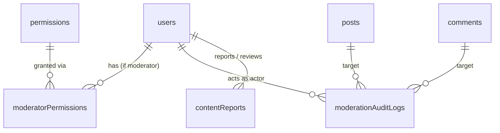

# Moderator RBAC & Granular Permission System

## 0. Current architecture (confirmed from codebase)

- **Stack**: Cloudflare Workers + [Hono](apps/api/src/index.ts) + Drizzle ORM over D1 (SQLite). Frontend: React + Vite, no router library, no auth Context — [App.tsx](apps/web/src/App.tsx) is one large component holding `currentUser`/`token` state and prop-drilling everything down.
- **Auth**: JWT (`hono/jwt`) with claims `{id, username, role, exp}`, signed/verified in [lib/auth.ts](apps/api/src/lib/auth.ts). `getAuthUser(c)` re-reads the full user row from D1 on every request (not just JWT claims) — this is the natural place to add moderation/permission enforcement.
- **Role today**: `users.role` is a plain `text` column, values `'user' | 'admin'` (see [schema.ts](packages/db/src/schema.ts) and `User` type in [packages/types/src/index.ts](packages/types/src/index.ts)). Checks are inlined per-route as `if (!authUser || authUser.role !== 'admin') return c.json({error:'Forbidden'},403)` — no shared middleware, but a very consistent pattern (seen in [admin.ts](apps/api/src/routes/admin.ts), [posts.ts](apps/api/src/routes/posts.ts), [audit-logs.ts](apps/api/src/routes/audit-logs.ts)).
- **Reports**: [lib/reports.ts](apps/api/src/lib/reports.ts) + [routes/reports.ts](apps/api/src/routes/reports.ts) — `content_reports` table, status `pending|dismissed|action_taken`, reviewed only by admins via `admin.patch('/reports/:id', ...)`.
- **Audit**: [lib/audit.ts](apps/api/src/lib/audit.ts) writes to `audit_logs` — this table is purpose-built for **security/auth events** (fixed `AuditEventType` enum, geo/device columns, 90-day retention/purge policy). It is not a generic moderation-action log, so moderation actions need a **new** table rather than overloading this one.
- **Migrations**: Drizzle Kit generates numbered SQL files in [packages/db/migrations](packages/db/migrations) (`0000`…`0052`) from [schema.ts](packages/db/src/schema.ts); applied via `wrangler d1 migrations apply`. New migration will be `0053_moderator_rbac.sql`.
- **Admin UI**: [AdminDashboard.tsx](apps/web/src/components/admin/AdminDashboard.tsx) composes collapsible sections ([RegisteredAccounts.tsx](apps/web/src/components/admin/RegisteredAccounts.tsx), [ReportsQueue.tsx](apps/web/src/components/admin/ReportsQueue.tsx), [AuditLogsPanel.tsx](apps/web/src/components/admin/AuditLogsPanel.tsx), etc.), all fed by handlers/state living in `App.tsx` and gated by `currentUser?.role === 'admin'` (e.g. line ~4299, ~4801).
- **No existing concept of**: moderator role, granular permissions, user suspend/ban/restrict (only soft-delete via [lib/user-lifecycle.ts](apps/api/src/lib/user-lifecycle.ts)), post/comment "hide" (only soft-delete via `deletedAt`), or Global Feed/Featured posts (does not exist anywhere in the repo).

**Confirmed scope decisions:**
- Global Feed / Featured Post: **skip the feature**, only reserve `featured_post.*` permission keys in the catalog for future use (no schema/table/workflow now).
- User moderation (warn/restrict/suspend/ban): **fully enforced** — suspended/banned users are blocked at login and at every authenticated request; restricted users are blocked from creating posts/comments.

---

## 1. Database changes (`packages/db/src/schema.ts` + new migration `0053_moderator_rbac.sql`)

### 1.1 Extend `users`
- `role` stays `text` (no migration needed) but now allows `'user' | 'moderator' | 'admin'`.
- New columns:
  - `moderator_status` (text, nullable) — `'active' | 'suspended'`, meaningful only when `role='moderator'`. Suspending here disables permission checks but **preserves** `moderator_permissions` rows so reactivation restores the exact prior set (spec §15).
  - `account_moderation_status` (text, default `'active'`, not null) — `'active' | 'restricted' | 'suspended' | 'banned'`. Applies to any user; drives real enforcement.
  - `account_moderation_reason` (text, nullable)
  - `account_moderation_until` (text, nullable) — ISO timestamp for timed suspensions; null + status=`suspended` means indefinite; ban is always indefinite until explicit unban. **No cron job needed**: `getAccountModerationBlockReason` treats an expired `account_moderation_until` as not-blocked on read (lazy expiry), and fires a best-effort `c.executionCtx.waitUntil(...)` update to flip `account_moderation_status` back to `'active'` so subsequent admin list views reflect it without waiting for the user's next request.
  - `account_moderation_set_by` (integer, FK → users.id, `set null`)
  - `account_moderation_set_at` (text, nullable)

### 1.2 New `permissions` table
`id, key (unique text), name, description, category, created_at, updated_at`. Seeded directly in the migration with INSERT statements for every key in §2 below (stable catalog, like a reference table).

### 1.3 New `moderator_permissions` table (many-to-many)
`id, user_id (FK users, cascade), permission_id (FK permissions, cascade), granted_by (FK users, set null), created_at, updated_at`, unique index on `(user_id, permission_id)`.

### 1.4 New `moderation_audit_logs` table (distinct from security `audit_logs`)
`id, actor_id (FK users, set null), actor_role, action (text, e.g. "post.hide"), target_type (text), target_id (integer, nullable), reason (text, nullable), metadata (text/JSON, nullable), before_state (text/JSON, nullable), after_state (text/JSON, nullable), created_at`. Indexes on `actor_id`, `action`, `(target_type, target_id)`, `created_at`. This is the "every meaningful moderation action recorded" log from spec §27, and is what feeds "View Moderator Activity" and per-user "View History".

### 1.5 Extend `posts` and `comments`
Reuse the **existing** `deleted_at` soft-delete column for hide/remove so every existing visibility query (feed, profile, search, threads, hashtags, reposts) keeps working with zero risk of missing a call-site. Add metadata alongside it:
- `moderation_action` (text, nullable) — `'hidden' | 'removed'` (null = not moderated / plain self- or admin-delete as today).
- `moderation_reason` (text, nullable)
- `moderated_by` (integer, FK users, `set null`)
- `moderated_at` (text, nullable)

`post.hide`/`post.unhide` toggle `moderation_action='hidden'` + `deleted_at`; `post.remove`/`post.restore` toggle `moderation_action='removed'` + `deleted_at`. Restoring always requires the matching permission for the action that was taken (`unhide` can't lift a `removed` post, `restore` can't lift a `hidden` one) — enforced in the service layer, not the DB.

**Author visibility & moderator queues (important nuance):** reusing `deleted_at` means a moderated post disappears from the author's own view exactly like a real delete unless we special-case it. Two deliberate exceptions to the "always filter `deletedAt IS NULL`" convention:
- **Single-post fetch (`GET /posts/:id`) and "my profile" post list**: when the viewer is the post's author and `moderation_action IS NOT NULL`, bypass the delete filter for that row and return it with a `moderationNotice: { action: 'hidden' | 'removed', reason, moderatedAt }` field instead of a 404/omission, so the author knows why their content disappeared and why.
- **Moderator/admin review queries** (new `GET /api/moderation/posts?moderationAction=hidden|removed` and the comment equivalent): these intentionally query `WHERE moderation_action IS NOT NULL` directly and must **not** reuse the standard feed/profile query helpers (which hard-filter `deletedAt IS NULL`) — they need their own query in `lib/moderation.ts`, separate from the pending-`content_reports` queue used for the dashboard counts.

### 1.6 `posts.comments_locked`
`integer default 0` — backs `comment.lock`/`comment.unlock` (locking a post's comment thread). Checked in the create-comment handler.

### 1.7 Extend `content_reports`
Add `resolution_reason` (text, nullable), `escalated_at` (text, nullable), `escalated_by` (integer FK users, nullable). `ReportStatus` (TypeScript/zod only, no DB constraint) grows from `'pending'|'dismissed'|'action_taken'` to also include `'in_review'|'resolved'|'escalated'` — additive, old values keep working.

---

## 2. Shared types & permission catalog (`packages/types/src/index.ts`)

- `PermissionKey` union: all keys from the spec — `post.view|review|hide|unhide|remove|restore|feature|unfeature`, `comment.view|review|hide|unhide|remove|restore|lock|unlock`, `user.view|view_history|warn|restrict|suspend|unsuspend|ban|unban`, `report.view|review|resolve|dismiss|escalate`, `featured_post.view|review|approve|reject|remove|restore|escalate` (reserved, unused by any route), `moderator.view|activity`, `audit.view`.
- `PERMISSION_CATALOG: PermissionCatalogEntry[]` — `{key, name, description, category}` for every key above (category ∈ `Posts|Comments|Users|Reports|Global Feed|Moderators|Audit`); Global Feed entries flagged `comingSoon: true` and never checked by any handler.
- `MODERATOR_PRESETS`: `Basic Moderator | Content Moderator | Community Moderator | User Moderator | Senior Moderator` → `PermissionKey[]` (template lists only — never consulted at authorization time).
- `DEFAULT_MODERATOR_PERMISSIONS`: the safe baseline from spec §14 (`report.*` minus none, `post.view`, `post.hide`, `comment.view`, `comment.hide`) applied when an admin promotes a user without picking permissions.
- `User['role']` widened to `'user' | 'moderator' | 'admin'`; add `moderatorStatus?`, `accountModerationStatus?` to the `User` interface (self-view only where relevant).
- New zod schemas: `PromoteModeratorSchema`, `UpdateModeratorPermissionsSchema` (`{permissionKeys: PermissionKey[]}`), `ModerationReasonSchema` (`{reason: string min 1}`), `SuspendUserSchema` (`{reason, until?}`), `ReviewReportV2Schema` (`{action: 'review'|'resolve'|'dismiss'|'escalate', reason?}`).
- New interfaces: `ModeratorSummary`, `ModeratorDetail`, `ModerationAuditLogEntry`, `ModerationAuditLogPage`.

---

## 3. Backend authorization engine (new files)

- **`apps/api/src/lib/permissions.ts`** — single source of truth:
  - `getUserPermissions(db, user)` → `Set<PermissionKey> | 'all'` (admin ⇒ `'all'`; active moderator ⇒ DB-backed set; suspended moderator or plain user ⇒ empty set).
  - `hasPermission(db, user, key)`, `hasAnyPermission(...)`, `hasAllPermissions(...)`.
  - In-request memoization via **Hono's native context variables** (`c.set('permissions', permSet)` / `c.get('permissions')`), not a module-level `WeakMap` — Workers isolates can reuse/recycle across requests, so anything module-scoped must stay stateless; `Hono<{Bindings: Env, Variables: {authUser?: AuthUser; permissions?: Set<PermissionKey> | 'all'}}>` is added additively (existing routes that only declare `Hono<{Bindings: Env}>` are unaffected).
  - `getUserPermissions`/`hasPermission` always re-derive from the DB-loaded `authUser` row — never from raw JWT claims. The existing fast-path `getJwtClaims`/`isAdminJwtClaims` (used only for rate-limit bypass) is left untouched and is explicitly **not** extended to moderators, so a stale/forged JWT role claim can never grant moderator permissions without a live DB check.
- **`apps/api/src/lib/moderation-guard.ts`**:
  - `getAccountModerationBlockReason(user)` → `'suspended' | 'banned' | null` (checks `account_moderation_status` + `account_moderation_until` expiry).
  - `canActOnTarget(actorRole, targetRole)` — admin: anyone except self where already restricted today; moderator: only plain `'user'` targets, never `'moderator'`/`'admin'` (spec §19/§9).
- **`apps/api/src/lib/auth-middleware.ts`** — Hono middleware factories for *new* routes, per spec §17 style:
  - `requireAuth()`, `requireRole(role)`, `requirePermission(key)` — all backed by `getAuthUser`/`hasPermission` above. Existing route files keep their inline `getAuthUser(c)` pattern (low risk to refactor); they'll call the same `hasPermission` helper directly instead of the middleware wrapper, so there is exactly one authorization implementation either way.
- **`apps/api/src/lib/moderation.ts`** — action service layer (permission-checked by the caller, this layer just performs the state change + writes `moderation_audit_logs` + notifies + broadcasts realtime):
  - Posts: `hidePost`, `unhidePost`, `removePost`, `restorePost`, `lockPostComments`, `unlockPostComments`.
  - Comments: `hideComment`, `unhideComment`, `removeComment`, `restoreComment`.
  - Users: `warnUser`, `restrictUser`, `liftRestriction`, `suspendUser`, `unsuspendUser`, `banUser`, `unbanUser` — all update `account_moderation_*` columns and notify the target user via the existing notification system.
- **`apps/api/src/lib/moderators.ts`** — moderator-management service (admin-only callers):
  - `listModerators`, `getModeratorDetail`, `promoteToModerator` (sets `role='moderator'`, `moderator_status='active'`, inserts `moderator_permissions`, applies `DEFAULT_MODERATOR_PERMISSIONS` when none given), `updateModeratorPermissions`, `suspendModerator`, `reactivateModerator`, `removeModeratorRole` (role→`'user'`, keeps `moderator_permissions` rows for history but they become inert).
  - **D1 has no interactive `BEGIN...COMMIT` transactions** — `updateModeratorPermissions` (and any other multi-statement write, e.g. hide/remove-post + audit-log insert) uses Drizzle's `db.batch([deleteStmt, ...insertStmts, auditLogInsertStmt])` so the diff + audit row commit atomically in one D1 batch call, computing the `{added, removed}` diff in memory first and passing prepared Drizzle query-builder statements (not raw SQL strings) into the array.
  - Guards: admin cannot target self or another admin/self-promote; cannot act via this path on non-existent/deleted users.
- Extend **`lib/reports.ts`**: `reviewReport` gains `review`/`resolve`/`escalate` actions (existing `dismiss`/`delete_content`/`delete_user` untouched) with per-action permission requirement (`report.review`, `report.resolve`, `report.escalate`); escalation stamps `escalated_at`/`escalated_by` and blocks further mod-level transitions (admin-only from there).

---

## 4. Enforcement wiring into existing code

- **Do NOT make `getAuthUser` return `null` for suspended/banned users.** `null` from `getAuthUser` means "unauthenticated" everywhere it's called, and every route responds `401` — the frontend's generic 401 handling clears the token and silently bounces the user to the logged-out screen with zero explanation of *why*, indistinguishable from an expired session. Instead, reuse the **existing global account-guard middleware pattern** already in [index.ts](apps/api/src/index.ts) (the one that blocks incomplete accounts with `{error, code: blockReason}` + `403`):
  - `getAuthUser` keeps returning the real user row unchanged (so `authUser.id`/`.role` stay available if a route needs them for something benign).
  - Add a sibling check in that same `app.use('/api/*', ...)` middleware (after the existing incomplete-account check): if `getAccountModerationBlockReason(authUser)` returns `'suspended'` or `'banned'`, respond `403` with a structured body `{ error, code: 'account_suspended' | 'account_banned', reason, until }` — mirroring `getAccountBlockReason`/`getAccountBlockMessage`'s existing shape exactly, so the frontend's already-planned handling of that 403 shape (see §6) just needs one more `code` branch.
  - Extend `INCOMPLETE_ACCOUNT_ALLOWLIST`-style logic so suspended/banned users can still hit `/api/auth/logout` and a new lightweight `GET /api/moderation/me/status` (returns their own status/reason/until) so the frontend can render the informative modal even while blocked.
- **`routes/auth.ts` `login`**: check the same block reason right after password/Google verification and return the same structured `403` (not a generic `401`) with `{code, reason, until}`, before issuing a token.
- **`routes/posts.ts` create-post** and **`routes/comments.ts` create-comment**: reject with `403` when `account_moderation_status === 'restricted'`.
- **`routes/posts.ts` `DELETE /:id`**, **`routes/comments.ts` `DELETE /:id`**: extend the existing `authUser.role !== 'admin' && authUser.id !== post.userId` check to also allow moderators with `post.remove`/`comment.remove` (via `canActOnTarget` against the content owner's role).
- **`admin.ts` reports endpoints** (`GET/PATCH /reports*`): change the hard `role !== 'admin'` guard to `hasAnyPermission(..., ['report.view'])` / action-specific checks, so permitted moderators can use the same endpoints (admin retains full access automatically since admin ⇒ `'all'`).
- **`admin.ts` `PUT /users/:id/role`**: keep accepting only `'user'|'admin'` (unchanged) and explicitly reject `'moderator'` with a message pointing to the new moderator endpoints — prevents creating a zero-permission "ghost" moderator through the old generic toggle.

---

## 5. New API routes

- **`apps/api/src/routes/admin-moderators.ts`** → mounted at `/api/admin/moderators` (all `requireAuth + requireRole('admin')`):
  - `GET /` list + status filter, `GET /:id` detail (permissions + recent activity), `POST /` promote (`{userId, permissionKeys? | preset?}`), `PUT /:id/permissions` replace set (transactional + audit diff), `PATCH /:id` `{status: 'suspended'|'active'}` suspend/reactivate, `DELETE /:id` remove moderator role (soft — role→`user`), `GET /:id/activity` paginated moderation audit trail for that moderator.
- **`apps/api/src/routes/permissions.ts`** → mounted at `/api/admin/permissions`: `GET /` full catalog + presets (admin-only).
- **`apps/api/src/routes/moderation.ts`** → mounted at `/api/moderation` (permission-gated per action, usable by admin or permitted moderator):
  - `POST /posts/:id/hide|unhide|restore`, `POST /posts/:id/lock-comments|unlock-comments`.
  - `POST /comments/:id/hide|unhide|restore`.
  - `POST /users/:id/warn|restrict|suspend|unsuspend|ban|unban`, `GET /users/:id/history` (`user.view_history`).
  - `GET /dashboard` — counts per module the caller can access (reports by status/type today; Posts/Comments "awaiting review" derived from pending `content_reports` grouped by `target_type`, since no separate review queue exists yet).
- **`apps/api/src/routes/me.ts`**: extend `MeBootstrap`/`GET /bootstrap` with `permissions: PermissionKey[] | 'all'` (empty for plain users) so the frontend can build its permission context without a second round trip.
- Register all new route files in [index.ts](apps/api/src/index.ts) alongside the existing `app.route(...)` calls.

---

## 6. Frontend

- **`apps/web/src/lib/permissions.tsx`** (new): a small, self-contained `PermissionsContext` + `usePermissions()` returning `{ can(key), canAny, permissions, role, isAdmin, isModerator }`. Mounted once near the top of the tree, fed by `currentUser`/bootstrap state that already exists in `App.tsx` — additive, no refactor of the existing prop-drilled architecture required.
- **`apps/web/src/lib/appRoutes.ts`**: add `'moderators'` to `AdminSection` (new Admin → Moderators tab) and a new top-level route `{view:'moderator'}` (`/moderator`) for the Moderator Dashboard.
- **Admin UI** (new components under `apps/web/src/components/admin/`):
  - `AdminModerators.tsx` — list (search, status filter, permission count, created date, last activity) + row actions (View / Edit Permissions / Suspend / Reactivate / Remove / View Activity).
  - `ModeratorPermissionMatrix.tsx` — checkbox matrix grouped by category, preset dropdown (fills the checkboxes, does not gate them), Select All / Clear All / Save / Cancel, dangerous permissions (`user.ban`, `user.suspend`, `moderator.*`) visually flagged.
  - `PromoteModeratorModal.tsx` — search an existing user (reuses the fuzzy-search pattern from `RegisteredAccounts.tsx`), pick preset/customize, confirm.
  - Wire into [AdminDashboard.tsx](apps/web/src/components/admin/AdminDashboard.tsx) as a new collapsible section / tab.
  - [RegisteredAccounts.tsx](apps/web/src/components/admin/RegisteredAccounts.tsx): disable the generic Promote/Demote button for `role==='moderator'` rows, add a "Manage as Moderator" link into the new tab instead, and add a `moderator` badge color.
- **Moderator Dashboard** (new, `apps/web/src/components/moderator/`):
  - `ModeratorDashboard.tsx` — overview counts + dynamically shown sections (Reports / Posts / Comments / Users / Activity) based on `can(...)`, reusing `ReportsQueue.tsx` (extended with `resolve`/`escalate` actions and a shared `ReasonPromptModal.tsx` for reason-required actions per spec §29).
  - [AppHeader.tsx](apps/web/src/components/layout/AppHeader.tsx): add a moderator nav entry gated by `role === 'moderator' && moderatorStatus === 'active'`, alongside the existing admin-only Shield icon.
- **Content actions**: add Hide/Remove controls to `PostCard.tsx`/`CommentItem.tsx` gated by `can('post.hide')`/`can('post.remove')`/etc., calling the new `/api/moderation/*` endpoints from new `App.tsx` handlers (mirroring the existing `handleReviewReport`/`fetchAdminReports` pattern).
- **Suspended/banned account modal**: extend whatever `App.tsx` already does with the existing incomplete-account `403 {error, code}` responses (username/email setup gates) with two new `code` branches (`account_suspended`, `account_banned`) that show a dedicated modal with the reason and `until` timestamp instead of logging the user out — this is the frontend half of the §4 change, and reuses the same response shape so it's one extra `switch`/`if` branch, not a new interceptor.
- All frontend gating is UX-only — every action re-validates server-side per §4/§5, satisfying the "never trust the client" requirement.

---

## 7. Notifications & audit

- Reuse the existing `notifications` table/pipeline ([lib/notifications.ts](apps/api/src/lib/notifications.ts), realtime broadcast in [lib/realtime.ts](apps/api/src/lib/realtime.ts)) for "your post was hidden", "you were warned/suspended", etc. — new `type` values added to the existing union, no new delivery system.
- Every moderation action (`post.hide`, `user.suspend`, `moderator.permissions.update`, `moderator.suspend`, `report.escalate`, …) writes one `moderation_audit_logs` row with actor, action, target, reason, and before/after snapshot for permission diffs — this powers "View Moderator Activity" and per-user "View History" (`user.view_history`).
- Appeals (`moderation_appeals`) are **not** built now, but the `moderation_audit_logs.id` gives a stable `moderation_action_id` FK target for a future appeals table, so no schema decision here blocks that later.

---

## 8. Migration & rollout risk

- Purely additive: new tables + new nullable/defaulted columns on `users`/`posts`/`comments`/`content_reports`. No existing column is renamed or removed; every existing query (`role !== 'admin'`, `deletedAt IS NULL`, etc.) keeps working unchanged.
- `role` values expand from 2 to 3 — every existing `role === 'admin'` / `role !== 'admin'` check was audited above; only `admin.ts PUT /users/:id/role` and the login/report-review guards need a deliberate update, everything else (posts/comments ownership checks, badge display, gamification equip caps) is unaffected because plain users' behavior is untouched.
- The new `/api/*` moderation-block middleware (§4) is the highest-leverage single change — it only fires for users with `account_moderation_status` set to `restricted/suspended/banned`, which defaults to `'active'` for all existing rows via the migration's `DEFAULT 'active'`, and it never changes `getAuthUser`'s existing null/non-null contract that the rest of the codebase depends on.

## Suggested implementation order (todos below)
1. DB schema + migration + seed permission catalog.
2. Shared types/zod schemas in `@hin/types`.
3. Backend permission engine + moderation-guard + moderation service + moderators service.
4. Wire enforcement into `getAuthUser`, login, post/comment create & delete, reports review.
5. New API routes (`admin-moderators`, `permissions`, `moderation`) + `me/bootstrap` permissions field.
6. Frontend permissions context + `appRoutes` additions.
7. Admin Moderators UI + Permission Matrix + Promote modal.
8. Moderator Dashboard + content Hide/Remove controls + reason-prompt modal.
9. Notification/audit wiring end-to-end, manual smoke test of full promote → grant → act → suspend → reactivate → remove lifecycle.
