# Platform Reviver — Gamification Design

> **Purpose:** Keep the platform awake and alive with interactive users. Not just posting and chatting — always something to do, something to earn, something to work toward.

This document captures the architecture and logic for a **badges, points, levels, and goals** system for HIN. It is a design reference for future implementation — grounded in the existing codebase (Drizzle + D1, Cloudflare R2, admin panel, `users.id` identity model).

**See also:** [Prerequisites](#prerequisites-before-starting) · [Implementation Hardening](#implementation-hardening-required-for-production) · [Starter Pack, Actions & Naming](#starter-pack-actions--naming) · [Phase granularity (4 vs 6 vs 8)](#phase-granularity-4-vs-6-vs-8)

---

## Why This Matters

Social platforms die when engagement becomes flat: post, scroll, chat, repeat. Gamification adds **loops**:

| Loop | Effect |
|------|--------|
| **Daily loop** | Login streaks, daily goals → users return tomorrow |
| **Action loop** | Share, comment, follow → each action feels rewarding (+points) |
| **Milestone loop** | Badges at 10, 50, 100 → long-term purpose |
| **Status loop** | Levels on profile → visible progress, social proof |
| **Discovery loop** | "3/7 days" progress bars → "I'm almost there" |

Users always have **something to do** beyond content consumption.

---

## High-Level Vision

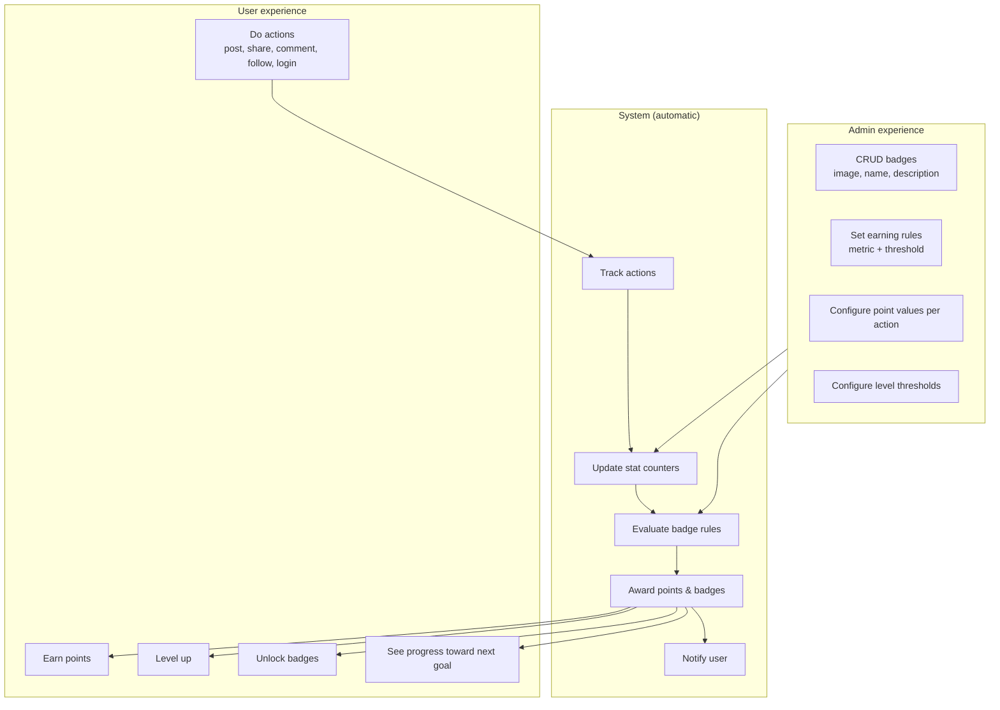

---

## Who Defines What

Three layers — developers own the engine, admins own the economy.

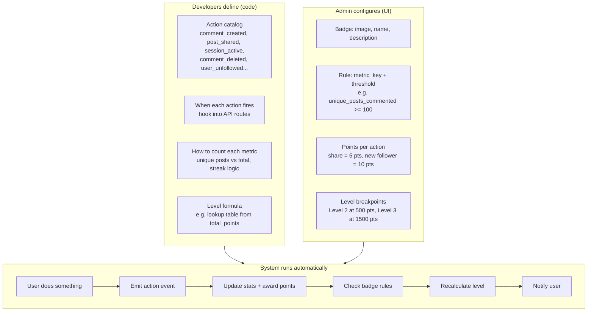

| Responsibility | Who | Example |
|----------------|-----|---------|
| What actions exist | **Developers** | `post_shared`, `follower_gained`, `login_streak` |
| When an action is recorded | **Developers** | After `POST /posts/:id/share`, `GET /api/me/bootstrap` (streak) |
| How to measure "unique shares" | **Developers** | `COUNT(DISTINCT post_id)` or increment only on new post |
| Badge image, name, description | **Admin** | "Super Sharer" badge |
| Threshold for a badge | **Admin** | `unique_posts_shared >= 100` |
| Points per action | **Admin** | Share = 5 pts, follower = 10 pts |
| Level thresholds | **Admin** or fixed formula | Level 2 at 500 pts |

**Admin cannot invent a brand-new action type from the UI alone** unless developers built that action and its counting logic. Admin picks from a **menu of supported metrics** and sets numbers.

---

## Linking Everything to the User

**Use existing `users.id` — not username, not a separate Gamification ID.**

Every feature in HIN already links via `userId` → `users.id` (posts, follows, shares, comments, notifications). Gamification follows the same pattern.

```mermaid
erDiagram
    users ||--o| user_gamification : has
    users ||--o{ user_stat_counters : tracks
    users ||--o{ user_badges : earns
    users ||--o{ points_ledger : history
    badges ||--o{ user_badges : grants

    users {
        int id PK
        string username
    }

    user_gamification {
        int user_id PK_FK
        int total_points
        int level
    }

    user_stat_counters {
        int user_id PK_FK
        string metric_key PK
        int value
    }

    user_badges {
        int user_id FK
        int badge_id FK
        datetime earned_at
    }

    badges {
        int id PK
        string name
        string description
        string image_url
        bool is_active
    }

    badge_rules {
        int badge_id FK
        string metric_key
        string operator
        int threshold
    }

    points_ledger {
        int user_id FK
        string action_type
        int delta
        json metadata
    }
```

| Identifier | Use for |
|------------|---------|
| `users.id` | All DB foreign keys, JWT, gamification engine |
| `username` | Display, profile URLs — resolve to `id` in API |

One person, one `users.id`, many gamification records pointing at it.

---

## Badges vs Points vs Levels

Three related concepts, one pipeline.

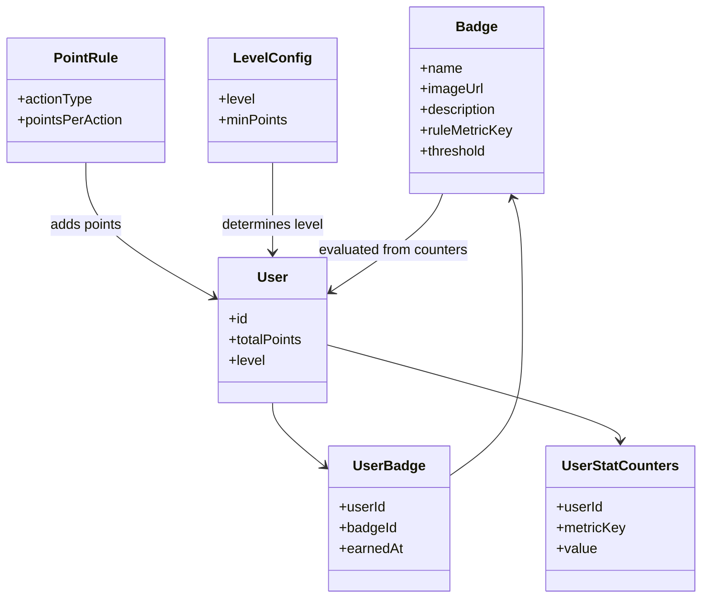

| Concept | Purpose | When it changes |
|---------|---------|-----------------|
| **Points** | Continuous currency, fuels levels | Every rewarded action |
| **Level** | Derived from total points | Points cross a threshold |
| **Badge** | One-time milestone / achievement | Threshold met once |

**Single action can trigger all three:**

> User shares their 100th unique post  
> → +5 points  
> → Level 3 → 4  
> → "Super Sharer" badge earned  
> → Notification: "You earned Super Sharer and reached Level 4!"

---

## Core Architecture: The Gamification Hub

**Do not** scatter badge checks inside every route. Use one stable entry point.

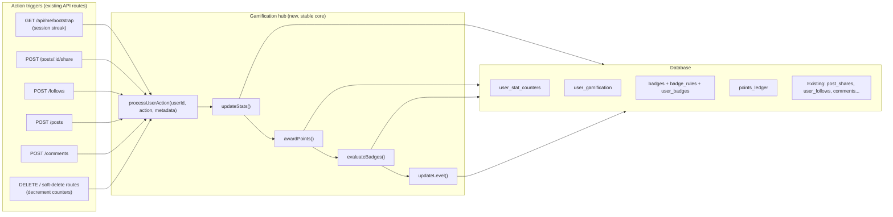

### Metric registry (future-proofing)

Each `metric_key` has a small handler. Adding a new goal = one registry entry, not a rewrite.

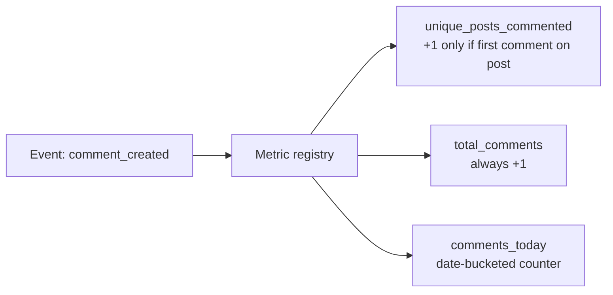

| Metric key | Updated when | Logic |
|------------|--------------|-------|
| `unique_posts_shared` | `post_shared` | +1 only if first share on that `postId` |
| `unique_posts_commented` | `comment_created` | +1 only if first comment by user on that `postId` |
| `follower_count` | `user_followed` | +1 for target user (passive rule) |
| `login_streak` | `session_active` | Calendar-day streak on bootstrap (not `POST /login`) |
| `total_posts` | `post_created` | +1 per post |

### Generic rule evaluator (write once)

```
for each active badge with rule:
  value = user's counter for badge.metric_key
  if value OPERATOR threshold:
    award badge (idempotent — never twice)
```

Same code evaluates shares, comments, followers, streaks.

---

## End-to-End Flow: One User Action

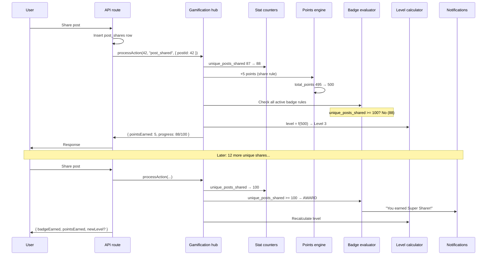

---

## Example Goals (Already Feasible in HIN)

### 100 shares on different unique posts

- **Data:** `post_shares` table (`userId`, `postId`) — already exists
- **Metric:** `unique_posts_shared` = distinct `postId` count per user
- **Hook:** `POST /posts/:id/share`
- **Note:** Same user can share the same post multiple times; "unique" means distinct posts only

### 100 followers

- **Data:** `user_follows` (`followerId`, `followingId`) — already exists
- **Metric:** `follower_count` for target user
- **Hook:** Follow handler — **passive rule** (evaluated for the user being followed, not the follower)

### Comment on 100 unique posts

- **Data:** `comments` (`userId`, `postId`) — already exists
- **Metric:** `unique_posts_commented`
- **Hook:** Comment create route
- **Adding later:** One metric handler + admin badge row — no hub rewrite if architecture above is used

### 7-day login streak

- **Data:** `user_streaks` row (`streak_type = 'login'`) + mirrored `login_streak` counter
- **Hook:** `GET /api/me/bootstrap` — **not** `POST /login`. HIN is an SPA; users keep JWTs in local storage and rarely hit the login endpoint daily. Bootstrap runs on every app open.
- **Logic:** Compare `last_activity_date` to today (UTC or configured timezone). Same calendar day = no change; yesterday = increment; gap > 1 day = reset to 1. Idempotent per day — multiple bootstrap calls on the same day do nothing.
- **No cron needed:** Evaluated on bootstrap or any authenticated session validation path

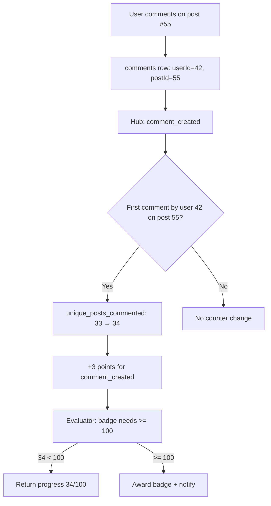

---

## Active vs Passive Rules

| Type | Who triggers | Example |
|------|--------------|---------|
| **Active** | Acting user | User shares → update their `unique_posts_shared` |
| **Passive** | Target user | Someone follows you → update *your* `follower_count` |
| **Time-based** | Bootstrap / session | 7-day login streak |

---

## Implementation Hardening (required for production)

Six adjustments that keep counters accurate, D1 writes safe, and performance predictable in the HIN SPA + D1 stack.

### 1. Session-based streak tracking (not `/login`)

**Problem:** Users open the app with a stored JWT; `POST /login` may not fire for days.

**Solution:** Emit `session_active` (or `login`) from `GET /api/me/bootstrap` in `apps/api/src/routes/me.ts` — after auth succeeds, before returning payload. The streak handler reads `user_streaks.last_activity_date`; if it differs from today's calendar date, update streak and mirror to `user_stat_counters.login_streak`.

```typescript
// me.ts — inside GET /bootstrap, after auth
if (gamificationEnabled) {
  await processUserAction(authUser.id, 'session_active', { source: 'bootstrap' });
}
```

Keep `POST /login` emission optional (first login of the day still works) but **bootstrap is the primary hook**.

### 2. Soft-deletion decrement hooks

**Problem:** Counters are incremented on write. Soft-deleted posts, comments, follows, shares, and unlikes must decrement — otherwise cached counts drift from reality.

**Solution:** Every soft-delete / undo route emits a paired decrement action after the primary row is updated:

| User action | Increment action | Decrement action |
|-------------|------------------|------------------|
| Create comment | `comment_created` | `comment_deleted` |
| Share post | `post_shared` | `post_unshared` |
| Follow user | `user_followed` | `user_unfollowed` |
| Create post | `post_created` | `post_deleted` |
| Like (if tracked) | `like_given` | `like_removed` |

```typescript
// After setting deletedAt on a comment
await processUserAction(userId, 'comment_deleted', { postId, commentId });
```

Metric handlers for decrement actions:
- `unique_posts_commented` — −1 only if this was the user's **last** active comment on that `postId`
- `unique_posts_shared` — −1 only if no other active share row exists for that `postId`
- `follower_count` (passive) — −1 for the unfollowed user
- `total_posts`, `total_comments` — −1 per deletion

**Badge policy unchanged:** earned badges are kept even if count drops (see Edge Cases). Decrements affect progress toward *unearned* badges and event leaderboards only.

### 3. Atomic D1 transactions in the hub

**Problem:** One action touches comments, counters, ledger, badges, and `user_gamification`. A partial failure leaves inconsistent state.

**Solution:** Wrap the entire hub pipeline inside `db.transaction()` (D1 batch) in `processUserAction`. The route should call the hub **after** the primary entity write (comment, share, etc.) succeeds, and the hub transaction includes all gamification tables. If the transaction fails, the route can return 500; the primary write already committed — design routes so gamification runs in the same request but document that primary + gamification are sequential (primary first, then hub). For tighter coupling, wrap primary + gamification together when the route owns both:

```typescript
await db.transaction(async (tx) => {
  await tx.insert(comments).values({ ... });
  await runGamificationPipeline(tx, userId, 'comment_created', metadata);
});
```

Prefer a single transaction when the route inserts the social row and calls the hub in the same handler.

### 4. Concurrency-safe counter UPSERTs

**Problem:** Rapid double-clicks (e.g. share) can race on the same `(userId, metricKey)` row.

**Solution:** Composite primary key + SQLite `ON CONFLICT`:

```typescript
export const userStatCounters = sqliteTable('user_stat_counters', {
  userId: integer('user_id').notNull().references(() => users.id, { onDelete: 'cascade' }),
  metricKey: text('metric_key').notNull(),
  value: integer('value').notNull().default(0),
}, (table) => ({
  pk: primaryKey({ columns: [table.userId, table.metricKey] }),
}));
```

```typescript
await db.insert(userStatCounters)
  .values({ userId, metricKey, value: delta })
  .onConflictDoUpdate({
    target: [userStatCounters.userId, userStatCounters.metricKey],
    set: { value: sql`${userStatCounters.value} + ${delta}` },
  });
```

Use `delta = +1` or `delta = -1`. Unique-post metrics still gate the delta in handler logic (only emit when first/last active row).

### 5. Dedicated notification types for gamification

**Problem:** Routing badge/level awards as `type: 'system'` makes filtering and UI styling harder.

**Solution:** Extend `notifications.type` and `@hin/types` `Notification['type']`:

| New type | When | `entityType` / `entityId` |
|----------|------|---------------------------|
| `badge_award` | Badge earned | `entityType: 'badge'`, `entityId: badgeId` |
| `level_up` | Level increased | `entityType: 'system'`, `entityId: null`, metadata: `{ level }` |

Migration adds the new enum values; existing types (`like`, `comment`, `message`, `mention`, `system`, follow types) unchanged. Frontend notification renderer branches on `badge_award` / `level_up` for distinct icons and copy. Add optional `notifyGamification` user setting (default on) mapped like other `NotificationPrefType` entries.

### 6. Active-event cache (5-minute TTL)

**Problem:** Multiple concurrent events × every comment/share = repeated `events` table queries per action.

**Solution:** Cache active events in Worker module scope with TTL:

```typescript
let activeEventsCache: { events: Event[]; fetchedAt: number } | null = null;
const EVENTS_CACHE_TTL_MS = 5 * 60 * 1000;

async function getActiveEvents(db: DB): Promise<Event[]> {
  const now = Date.now();
  if (activeEventsCache && now - activeEventsCache.fetchedAt < EVENTS_CACHE_TTL_MS) {
    return activeEventsCache.events;
  }
  const events = await db.select().from(eventsTable).where(/* starts_at <= now <= ends_at */);
  activeEventsCache = { events, fetchedAt: now };
  return events;
}
```

Invalidate cache on admin event create/update/delete (`activeEventsCache = null`). Stale window ≤ 5 minutes is acceptable for event progress; admin changes propagate quickly via explicit invalidation.

---

## Database Design Principles

### Use `metric_key` counters, not a column per goal

| user_id | metric_key | value |
|---------|------------|-------|
| 42 | `unique_posts_shared` | 88 |
| 42 | `unique_posts_commented` | 34 |
| 42 | `follower_count` | 67 |
| 42 | `login_streak` | 5 |

**New goal = new `metric_key`, not a schema migration every time.**

### Separate definitions, progress, and awards

| Table | Role |
|-------|------|
| `badges` | Admin-defined: image, name, description, active flag |
| `badge_rules` | `metric_key`, `operator`, `threshold` per badge |
| `user_stat_counters` | Per-user progress toward metrics |
| `user_badges` | Earned badges (`user_id`, `badge_id`, `earned_at`) — unique pair |
| `user_gamification` | `total_points`, `level` per user |
| `points_ledger` | Audit: why points changed |
| `point_rules` | Admin: action type → points |
| `level_config` | Admin: min points per level |

### Optional later: `user_action_log`

For time-window rules ("5 comments in one day"). Start with counters; add log when needed.

---

## Backend Conventions (align with existing HIN patterns)

- Routes in `apps/api/src/routes/` — e.g. `admin/badges`, `me/gamification`
- Business logic in `apps/api/src/lib/gamification/` — hub, registry, evaluator
- Schema in `packages/db/src/schema.ts` + migrations
- Types + Zod in `packages/types`
- Admin guard: `authUser.role === 'admin'` (same as existing `admin.ts`)
- Badge images: extend R2 upload type `'badge'`, admin-only
- Hook routes with **one line** after success: `processUserAction(userId, action, metadata)`
- Soft-delete / undo routes emit paired **decrement** actions (see Implementation Hardening §2)
- Hub runs inside **`db.transaction()`** for atomic counter + ledger + badge writes (see §3)
- Counter updates use **composite PK + `onConflictDoUpdate`** (see §4)

---

## Frontend Conventions (data-driven, not per-badge screens)

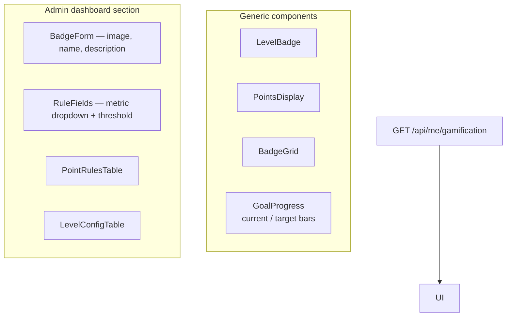

### Example API response shape

```json
{
  "level": 7,
  "totalPoints": 1250,
  "pointsToNextLevel": 250,
  "badges": [
    {
      "id": 3,
      "name": "Conversationalist",
      "imageUrl": "/api/media/...",
      "earnedAt": "2026-03-01T12:00:00Z"
    }
  ],
  "goalsInProgress": [
    {
      "badgeId": 5,
      "name": "Unique Commenter",
      "description": "Comment on 100 different posts",
      "current": 34,
      "target": 100,
      "metricKey": "unique_posts_commented"
    }
  ]
}
```

New badges appear automatically in `goalsInProgress` — no new React component per goal.

### Admin metric catalog API

Backend exposes available metrics for the rule dropdown:

```json
{
  "metrics": [
    {
      "key": "unique_posts_commented",
      "label": "Unique posts commented on",
      "description": "Distinct posts the user has commented on"
    },
    {
      "key": "follower_count",
      "label": "Followers",
      "description": "Users following this account"
    }
  ]
}
```

---

## Edge Cases & Policy Decisions

| Scenario | Recommended policy |
|----------|-------------------|
| User unfollows → count drops below 100 | **Keep badge** (standard) |
| User shares same post many times | Count as **1** unique share |
| Admin lowers threshold after earners exist | Existing earners **keep** badge |
| Admin deletes badge | Soft-deactivate; keep `user_badges` history |
| Soft-deleted follow/comment/share/post | **Exclude** from counts — emit decrement action on soft-delete (see Implementation Hardening §2) |
| Points inflation | Cap daily points or diminishing returns (later) |
| Admin impersonation | Disable gamification actions or audit separately |

---

## Anti-Patterns to Avoid

| Don't | Why |
|-------|-----|
| Badge logic inside each route | Unmaintainable at scale |
| One DB column per goal | Migration for every new metric |
| Username as foreign key | Unstable; use `users.id` |
| Separate Gamification ID | Redundant mapping |
| Hardcoded badge list in React | Every new badge = frontend deploy |
| Admin-defined arbitrary SQL rules | Security nightmare |

---

---

## Metric Types & Naming (Dev vs Admin)

Rules are not all the same shape. Developers register **metrics** by type; admin attaches **badges** (display + threshold) to those metrics.

### Four metric types

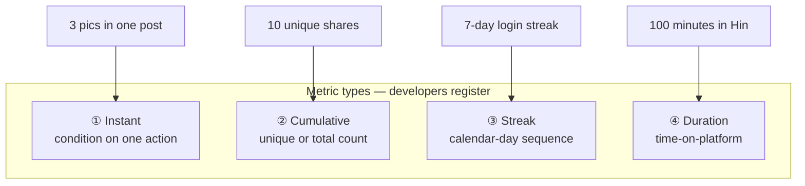

| Example | Type | Action (dev) | Metric key (dev) | Admin badge rule |
|---------|------|--------------|------------------|------------------|
| Upload 3 pics in single post | **Instant** | `post_created` | `posts_with_3_images` | ≥ 1 |
| Share 10 unique posts | **Cumulative** | `post_shared` | `unique_posts_shared` | ≥ 10 |
| Daily login 7-day streak | **Streak** | `session_active` | `login_streak` | ≥ 7 |
| Spend 100 minutes in Hin | **Duration** | `session_tick` | `total_session_minutes` | ≥ 100 |

### Where each piece lives

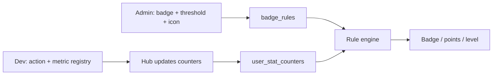

### Dev name vs admin name

| Field | Who sets | Sent to users? | Example |
|-------|----------|----------------|---------|
| `metric_key` | **Developer** | Never | `posts_with_3_images` |
| `action_type` | **Developer** | Never | `post_created` |
| Catalog **label** | Developer (shown in admin dropdown) | No | "Posts with 3+ images" |
| Badge **name** | **Admin** | Yes | "Triple Shot" |
| Badge **description** | **Admin** | Yes | "Upload 3 photos in one post" |
| Badge **image** | **Admin** (R2 upload) | Yes | `/api/media/badges/...` |
| **Threshold** | **Admin** | Optional | `>= 1` |

**Flow:** Dev ships `posts_with_3_images` → appears in admin metric dropdown → admin creates badge with custom name/icon/threshold. Admin **never** renames `metric_key`.

### Condition vs threshold

| Concept | Who controls | Example |
|---------|--------------|---------|
| **Condition** (when metric increments) | Developer | `mediaCount >= 3` |
| **Threshold** (when badge awards) | Admin | `posts_with_3_images >= 1` or `>= 10` |

Admin can create "Triple Shot" (≥ 1) and "Photo Fanatic" (≥ 10) on the **same metric** without a code deploy.

### Adding a new rule (checklist)

| Step | Who |
|------|-----|
| 1. Emit action from API route | Developer |
| 2. Register metric in `lib/gamification/metrics.ts` | Developer |
| 3. Metric appears in admin catalog API | Automatic on deploy |
| 4. Create badge: pick metric, set threshold, upload icon | Admin |
| 5. Progress + award via rule engine | Automatic |

---

## Starter Pack, Actions & Naming

Decisions from product/design review — how launch badges, programmed actions, and display names work together.

### Ship gamification with starter badges

Do **not** turn gamification ON with an empty badge list. Seed a **starter pack** when each phase's metrics are live. Badge rows are admin/seed data (no deploy per badge); metrics and route hooks must exist first.

| Phase when badge goes live | Badge name (default) | Description (default) | `metric_key` | Rule |
|----------------------------|----------------------|---------------------|--------------|------|
| **v2** | Getting Started | Publish 10 posts | `total_posts` | ≥ 10 |
| **v2** | Rising Voice | Reach 10 followers | `follower_count` | ≥ 10 |
| **v2** | Crowd Favorite | Get 10 likes on a single post | `max_likes_single_post` | ≥ 10 |
| **v3** | Week Regular | Open Hin 7 days in a row | `login_streak` | ≥ 7 |
| **v4** | Warming Up | Spend 5 active minutes on Hin | `total_session_minutes` | ≥ 5 |

Seed via migration/SQL or admin script at each phase — not hardcoded React components. Do **not** seed badges whose metrics are not wired yet (users would see unearn-able goals).

**Note:** `posts_with_3_images` in examples is illustrative — the launch pack above replaces it for go-live. Admin can add more badges on the same metrics later (e.g. "Prolific Poster" at 50 posts) without a deploy.

### Streak ≠ duration

| User idea | What it actually measures | Action | Metric |
|-----------|---------------------------|--------|--------|
| 7-day **active streak** | Opened app on 7 **calendar days** | `session_active` (bootstrap) | `login_streak` |
| **5 minutes active** | Time on site with tab active | `session_tick` (heartbeat) | `total_session_minutes` |

These are different metrics in different phases (v3 vs v4).

### Actions are programmed (admin cannot invent them)

Every reward starts with a developer-emitted **`action_type`** from an API route. The hub maps actions → metric handlers → counters → badge rules.

```typescript
// After primary write succeeds — one line per route
await processUserAction(userId, 'post_created', { postId, mediaCount });
await processUserAction(userId, 'session_active', { source: 'bootstrap' });
await processUserAction(postAuthorId, 'post_liked', { postId, likeCount }); // passive
```

### Starter action catalog (program this)

| Real-world event | `action_type` (stable code) | `metric_key` | Active / passive | Default catalog label |
|------------------|----------------------------|--------------|------------------|----------------------|
| User publishes post | `post_created` | `total_posts` | Active | Publish a post |
| User deletes post | `post_deleted` | `total_posts` (−1) | Active | — |
| Someone follows user | `user_followed` | `follower_count` | Passive (target) | Gain a follower |
| Someone unfollows | `user_unfollowed` | `follower_count` (−1) | Passive | — |
| User opens app (bootstrap) | `session_active` | `login_streak` | Active | Daily visit |
| Tab heartbeat (5 min) | `session_tick` | `total_session_minutes` | Active | Time on Hin |
| Someone likes user's post | `post_liked` | `max_likes_single_post` | Passive (author) | Likes on your post |
| Someone unlikes | `post_unliked` | `max_likes_single_post` (recalc) | Passive | — |

`max_likes_single_post` is **new** — add in **v2** with `post_liked` / `post_unliked` hooks in `routes/posts.ts` (like handler). Track the highest like count on any single post by that user.

### Two names: stable code + nice defaults

When registering an action/metric, ship a **friendly default label** in the admin catalog. Admin can rebrand user-facing copy anytime; code identifiers stay fixed.

| Layer | Who sets | Rename later? | Example |
|-------|----------|---------------|---------|
| `action_type` | Developer | Avoid — breaks hooks | `post_created` |
| `metric_key` | Developer | Avoid — breaks rules | `total_posts` |
| Catalog **label** | Developer (default) | Optional in admin metadata | "Publish a post" |
| Badge **name** | Admin (seed or UI) | **Yes** anytime | "Getting Started" |
| Badge **description** | Admin | **Yes** anytime | "Publish 10 posts" |
| **Threshold** | Admin | **Yes** anytime | ≥ 10 → ≥ 25 |

```text
Developer ships:  action_type + metric_key + defaultLabel (+ optional seed badge)
Admin owns:      badge name, description, icon, threshold
Users see:       badge name + progress ("7/10 posts") — never action_type or metric_key
```

### Existing app safety

Gamification is **additive** and **off by default** — existing behavior is preserved:

| Safeguard | Effect |
|-----------|--------|
| `gamification_enabled = false` (default) | Hub no-ops; zero extra D1 writes |
| Hook **after** primary write | Post/comment/follow succeeds even if hub fails |
| New tables only | No changes to posts, comments, likes, follows schema |
| Optional JSON fields | Bootstrap `g` block ignored by old clients |
| New notification types | `badge_award` / `level_up` added; existing types unchanged |

Implement **v1 → v2 → v3 → v4 sequentially** (one phase per PR). Fill in **Agent Handoff** after each phase before starting the next.

---

## Prerequisites (before starting)

Gamification is a **server-side layer on top of existing social actions** — not a separate client tracking stack. Confirm prerequisites **before v1**; phase-specific items are listed per phase below.

### Common misconceptions (clarified)

| Idea | What the doc actually means | Needed? |
|------|------------------------------|---------|
| **localStorage** | JWT already lives here; users rarely hit `POST /login` daily | ✅ Already assumed — explains why streaks use bootstrap, not a new build item |
| **sessionStorage** | Not used for gamification (only incidental UX, e.g. return URL) | ❌ Not a prerequisite |
| **User login tracking** | Track **app opens** via `session_active` on `GET /api/me/bootstrap` | ✅ Yes — **server-side** (`user_streaks` + bootstrap hook in **v3**) |
| **Location / geo tracking** | Not referenced anywhere in Platform Reviver | ❌ Not needed |
| **Timezone** | Calendar-day streaks use “today” in **UTC or configured timezone** | ✅ Useful in **v3** — store in `user_settings` or default UTC |

**Do not build** a separate localStorage/sessionStorage/location pipeline for gamification. Activity, streaks, and duration are **server-authoritative** actions emitted from API routes.

### Already in HIN (no new work required)

| Prerequisite | Status | Used for |
|--------------|--------|----------|
| `users.id` identity | ✅ Exists | All gamification FKs, JWT, hub entry point |
| Admin panel + `role === 'admin'` guard | ✅ Exists | Toggle, badge CRUD, point rules, events |
| R2 image upload | ✅ Exists | Extend with `badge` (and event banner) type in v2/v3 |
| `post_shares`, `user_follows`, `comments` | ✅ Exists | Metric sources for share/follow/comment badges |
| `GET /api/me/bootstrap` | ✅ Exists | Streak hook (`session_active`), optional `g` block when ON |
| Notifications + RealtimeDO | ✅ Exists | `badge_award`, `level_up`, `gamification_reward` toasts |

**Smoke test before v1:** login, feed, post, comment, follow, share — all unchanged.

### Must ship in v1 (foundation — before any earning)

| # | Prerequisite | Why |
|---|--------------|-----|
| 1 | Gamification DB schema + migration | `user_gamification`, `user_stat_counters`, `badges`, `badge_rules`, `point_rules`, `level_config` |
| 2 | `system_settings.gamification_enabled` | Master toggle — default `false`, zero D1 cost when OFF |
| 3 | Hub: `processUserAction()` | Single entry point — hub, registry, evaluator, counters, settings |
| 4 | Metric registry (developer-owned) | Admin picks from catalog; cannot invent `action_type` in UI |
| 5 | Atomic hub writes | D1 `transaction()` + composite PK `onConflictDoUpdate` on counters |
| 6 | Types: `GamificationPublic` vs internal | Client gets minimal DTO only; rules stay server-side |
| 7 | Admin read routes | Settings toggle + metrics catalog (CRUD comes in v2) |

### Per-phase prerequisites (do not skip ahead)

| Phase | Additional prerequisites |
|-------|------------------------|
| **v2** | `user_badges`, `points_ledger`, seed `level_config`; route hooks after primary writes; paired decrement hooks on soft-delete; R2 badge upload; `GET /api/me/gamification`; starter badge seed (metrics wired first); `badge_award` / `level_up` notification types |
| **v3** | `user_streaks`; `session_active` on bootstrap (idempotent per calendar day); timezone decision (UTC default or per-user); comment create/delete hooks; events tables; 5-min active-events cache; WS toast handler |
| **v4** | `POST /api/me/session-tick` heartbeat → `total_session_minutes`; anti-abuse (daily point cap, rate limits); admin user lookup; ledger archival |

### Cross-cutting rules (all phases)

- **Identity:** everything keyed to `users.id` — no separate Gamification ID
- **Server authority:** client never awards points or badges; displays outcomes only
- **Evaluate on write, not read:** badge checks on action, not every page load
- **Soft-delete parity:** every increment has a paired decrement so counters do not drift
- **Idempotent awards:** unique `(user_id, badge_id)` — never earn the same badge twice
- **Passive metrics:** e.g. `follower_count` updates on the **followed** user, not the follower
- **Starter content:** do not turn ON with an empty badge list — seed per phase when metrics are live
- **Cost:** flag OFF = hub no-op; milestone notifications only (not every +1 pt)

### Prerequisites checklist (copy before v1)

```text
[ ] Social stack smoke test passes (login, feed, post, comment, follow, share)
[ ] users.id used consistently — no username FKs in gamification tables
[ ] v1 migration applies cleanly on local D1
[ ] gamification_enabled defaults to false
[ ] processUserAction() no-ops when flag OFF (zero gamification D1 writes)
[ ] Hub uses transaction() for counter + ledger + award writes
[ ] user_stat_counters composite PK + onConflictDoUpdate verified
[ ] Metric registry returns catalog JSON for admin dropdown
[ ] Existing app behavior unchanged with flag OFF
```

---

## Implementation Plan (v1 → v4)

Four-phase rollout across **D1**, **API**, **web**, **R2**, and **RealtimeDO**. Each phase is shippable; later phases plug into the same hub — no rewrites.

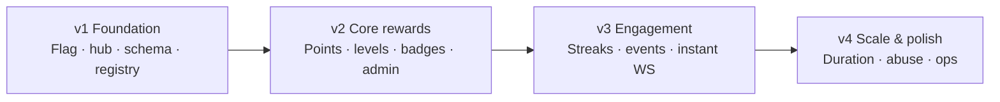

### Phase granularity: 4 vs 6 vs 8?

**Recommendation: keep 4 phases as the canonical plan.** They map cleanly to risk boundaries and are each shippable without rewrites. Split further only when a single phase is too large for one PR or one review cycle.

| Approach | When to use | Trade-off |
|----------|-------------|-----------|
| **4 phases (default)** | Solo dev or small team; one phase ≈ one PR | v2 and v3 are the largest chunks |
| **6 phases (optional)** | v2 or v3 repeatedly stalls review or causes regressions | More handoffs; clearer milestones |
| **8 phases** | Large team with parallel workstreams | Overhead outweighs benefit for HIN's current scale |

#### Why 4 is enough

| Phase | Natural boundary | Ships independently? |
|-------|------------------|----------------------|
| **v1** | Schema + hub + flag OFF | ✅ Zero user impact; proves architecture |
| **v2** | First real earning (points, badges, admin) | ✅ Admin can toggle ON in staging |
| **v3** | Retention loops (streaks, events, WS) | ✅ Adds daily return + time-boxed wins |
| **v4** | Production hardening (duration, abuse, ops) | ✅ Safe at scale |

Later goals (new metrics, badges, events) are **registry plugins** after v4 — not new rollout phases.

#### Optional 6-phase split (only if v2 or v3 is too big)

Use **sub-phase labels** in PR titles; do not renumber the master plan unless you formally adopt 6:

```text
v1   Foundation          (unchanged)
v2a  Core pipeline       Route hooks, decrements, points, ledger, starter metrics
v2b  Admin + profile UI  Badge CRUD, R2 images, level config, profile components
v3a  Streaks + comments  user_streaks, bootstrap session_active, timezone, comment hooks
v3b  Events + realtime   Event tables, cache, leaderboards, WS toasts
v4   Scale & polish      (unchanged — heartbeat, abuse, archival, admin ops)
```

#### When 8 phases would make sense (not recommended now)

Split v2 and v3 **and** v4 into backend vs frontend PRs — only if multiple engineers work in parallel and merge conflicts are frequent. For a single agent or one developer, 8 phases adds handoff overhead without reducing total work.

#### Decision rule

```text
Start with 4.
If a phase exceeds ~2 weeks or one PR touches >15 files across API + web + DB → split that phase into vXa/vXb only.
Never skip v1 or ship earning (v2+) without the hub + flag + transaction pattern from v1.
```

### Agent workflow (sequential — do not skip phases)

Implement **v1 → v2 → v3 → v4 one at a time**. Do not run multiple phases in parallel on the same branch.

After completing each phase, the agent **must** fill in that phase's **Agent Handoff** section below:

1. **What's done** — files, tables, routes, and behaviors actually shipped (be specific).
2. **What to verify** — run through the checklist; note pass/fail and any known gaps.
3. **Next steps** — leave clear instructions for the next agent starting the following phase.

Do not start the next phase until verification passes and handoff is written. Keep `gamification_enabled = false` in production until v2 is verified in staging.

---

### v1 — Foundation (hub off by default)

**Goal:** Ship the pipeline skeleton. Gamification **OFF** in production until v2. Zero user-facing UI. Proves architecture without D1 cost.

#### Database (`packages/db`)

| Table / setting | Purpose |
|-----------------|---------|
| `system_settings` key `gamification_enabled` | Master toggle (`false` default) |
| `user_gamification` | `user_id` PK, `total_points`, `level` |
| `user_stat_counters` | `user_id`, `metric_key`, `value` — **composite PK** `(user_id, metric_key)` |
| `badges` | `id`, `name`, `description`, `image_url`, `is_active` |
| `badge_rules` | `badge_id`, `metric_key`, `operator`, `threshold` |
| `point_rules` | `action_type`, `points`, `is_active` |
| `level_config` | `level`, `min_points` |

Migration in `packages/db/migrations/`. All FKs → `users.id` with `onDelete: cascade`.

#### Types (`packages/types`)

- `GamificationPublic` — minimal client DTO (`level`, `points`, `badges`, `goals`)
- `GamificationInternal` — server-only; never exported to web
- Zod schemas for admin payloads

#### Backend (`apps/api/src/lib/gamification/`)

| Module | Responsibility |
|--------|----------------|
| `hub.ts` | `processUserAction(userId, action, metadata)` — checks flag; wraps pipeline in `db.transaction()` |
| `registry.ts` | Metric catalog: `key`, `label`, `type`, handlers (stubs OK in v1) |
| `evaluator.ts` | Generic rule loop: `counter >= threshold` → idempotent award |
| `counters.ts` | Upsert `user_stat_counters` via `onConflictDoUpdate` (+/− delta) |
| `settings.ts` | Read/write `gamification_enabled` via existing `system-settings` pattern |

#### API routes

| Route | Notes |
|-------|-------|
| `GET /api/admin/gamification/settings` | Toggle + status (admin only) |
| `PATCH /api/admin/gamification/settings` | Enable/disable |
| `GET /api/admin/gamification/metrics` | Read-only metric catalog for admin dropdown |

No public gamification routes yet. Optional: one-line hub call in a single route (commented or behind flag) to prove wiring.

#### Frontend (`apps/web`)

- No user gamification UI
- Optional: admin placeholder section "Platform Reviver — coming in v2"

#### R2 / Durable Objects

- **R2:** Not used in v1
- **DO:** Not used in v1

#### v1 exit criteria

- [ ] Migration runs on local D1
- [ ] `gamification_enabled = false` → hub returns in &lt;1ms with zero gamification D1 writes
- [ ] `user_stat_counters` uses composite PK; counter upsert is concurrency-safe
- [ ] `processUserAction` rolls back all gamification writes on failure (transaction test)
- [ ] Metric registry returns catalog JSON
- [ ] Evaluator unit-tested with mock counters + rules

#### v1 Agent Handoff

> **Agent:** Fill this in when v1 is complete. Next agent reads this before starting v2.

##### What's done *(agent fills in)*

```text
Migration file: packages/db/migrations/________.sql
Schema tables added: user_gamification, user_stat_counters, badges, badge_rules, point_rules, level_config
Hub modules: apps/api/src/lib/gamification/{hub,registry,evaluator,counters,settings}.ts
Admin routes mounted at: /api/admin/gamification/...
gamification_enabled default: false
Other notes:
```

##### What to verify

- [ ] `pnpm` / project migration applies cleanly on local D1
- [ ] Existing app smoke test: login, feed, post, comment, follow — **unchanged** (no regressions)
- [ ] `GET /api/admin/gamification/settings` returns `{ gamificationEnabled: false }` (admin auth)
- [ ] `PATCH` toggle works; when `false`, `processUserAction()` returns immediately with **zero** gamification D1 writes
- [ ] `GET /api/admin/gamification/metrics` returns registry catalog JSON
- [ ] `user_stat_counters` has composite PK `(user_id, metric_key)`; upsert uses `onConflictDoUpdate`
- [ ] Hub unit test: transaction rolls back counters + ledger on simulated failure
- [ ] Evaluator unit test: mock counter crosses threshold → idempotent award logic passes
- [ ] No user-facing gamification UI shipped (optional admin placeholder only)

##### Next steps → v2

1. Read **v1 Agent Handoff** above — confirm all checks passed.
2. Read [Implementation Hardening](#implementation-hardening-required-for-production) §3–§5 (transactions, upserts, notification types).
3. Add migration: `user_badges`, `points_ledger`; seed `level_config`.
4. Implement 5 metric handlers: `unique_posts_shared`, `follower_count`, `total_posts`, `max_likes_single_post`, (+ optional `posts_with_3_images`).
5. Wire route hooks **after** primary write succeeds; add decrement hooks + `post_liked` / `post_unliked`.
6. Build admin CRUD + `GET /api/me/gamification` + optional `g` in bootstrap.
7. Seed starter badges: Getting Started, Rising Voice, Crowd Favorite.
8. Keep `gamification_enabled = false` in production until v2 exit criteria pass in staging.

---

### v2 — Core rewards (points, levels, badges, admin CRUD)

**Goal:** Admin turns gamification **ON**. Users earn points and badges on real actions. Badge images in R2. Profile shows level and badges.

#### Database

| Table | Purpose |
|-------|---------|
| `user_badges` | `user_id`, `badge_id`, `earned_at` — unique `(user_id, badge_id)` |
| `points_ledger` | `user_id`, `action_type`, `delta`, `created_at` (audit; cap rows later) |

Seed default `level_config` (e.g. L1=0, L2=500, L3=1500).

#### Metric registry — first 5 metrics (dev)

| Metric key | Type | Action | Handler summary |
|------------|------|--------|-----------------|
| `unique_posts_shared` | Cumulative | `post_shared` | +1 if new `postId` for user |
| `follower_count` | Cumulative (passive) | `user_followed` | +1 for target user |
| `total_posts` | Cumulative | `post_created` | +1 per post |
| `max_likes_single_post` | Cumulative (peak) | `post_liked` | Set to max(current, post like count) for post author |
| `posts_with_3_images` | Instant | `post_created` | +1 if `mediaCount >= 3` (optional; not in starter pack) |

**Starter pack seed (v2 go-live):** Getting Started (`total_posts` ≥ 10), Rising Voice (`follower_count` ≥ 10), Crowd Favorite (`max_likes_single_post` ≥ 10). See [Starter Pack, Actions & Naming](#starter-pack-actions--naming).

#### Backend

| Hook location | Action emitted |
|---------------|----------------|
| `routes/posts.ts` — create post | `post_created` + `{ mediaCount }` |
| `routes/posts.ts` — share | `post_shared` + `{ postId }` |
| `routes/posts.ts` — soft-delete post | `post_deleted` + `{ postId }` |
| `lib/follows.ts` — follow accepted | `user_followed` + `{ targetUserId }` |
| `lib/follows.ts` — unfollow | `user_unfollowed` + `{ targetUserId }` |
| `routes/posts.ts` — like (new like only) | `post_liked` + `{ postId, likeCount }` → passive for post author |
| `routes/posts.ts` — unlike | `post_unliked` + `{ postId, likeCount }` → passive for post author |

- Point rules applied per `action_type`
- Level recalc after points
- Rule engine awards badges
- `toGamificationPublic()` strips internal fields

#### API routes

| Route | Purpose |
|-------|---------|
| `GET/POST/PATCH/DELETE /api/admin/gamification/badges` | Badge + rule CRUD |
| `GET/PATCH /api/admin/gamification/point-rules` | Points per action |
| `GET/PATCH /api/admin/gamification/levels` | Level thresholds |
| `GET /api/me/gamification` | User's public gamification state |
| Embed `g` in `GET /api/me/bootstrap` | Level, points, badges when ON |

Action responses (share, post create) include minimal `g` block: `{ pe, pt, lv, be? }`.

#### R2

- Extend `apps/api/src/routes/media.ts`: upload type `'badge'`
- Store at `badges/{adminUserId}/{uuid}.ext`
- Admin-only upload guard
- Record in `media_uploads` with `type: 'badge'`

#### Durable Objects

- On badge earn: insert `notifications` row (`type: 'badge_award'`) + `broadcast-notification` to `RealtimeDO`
- On level up: insert `notifications` row (`type: 'level_up'`) + broadcast
- Extend `@hin/types` `Notification['type']` and migration for `badge_award`, `level_up` (not generic `system`)
- No new DO classes — reuse global `RealtimeDO`

#### Frontend

| Component | Location |
|-----------|----------|
| `AdminGamification` | `components/admin/` — toggle, badges, point rules, levels |
| `LevelBadge` / `PointsDisplay` | `AppHeader` or profile |
| `BadgeGrid` | `ProfileHeader` |
| `GoalProgress` | Profile or settings — from `goalsInProgress` API |

- Generic components only — driven by API, no per-badge React files
- Hide all gamification UI when `gamificationEnabled === false`

#### v2 exit criteria

- [ ] Admin creates badge (icon + rule) without deploy
- [ ] User shares 100th unique post → badge + points in API response
- [ ] 3-image post → `posts_with_3_images` badge when admin rule exists
- [ ] Follower badge awards passive user on follow
- [ ] Toggle OFF freezes earning; earned badges remain visible
- [ ] Badge notification appears in bell (via DO)
- [ ] Starter pack seeded: Getting Started, Rising Voice, Crowd Favorite

#### v2 Agent Handoff

> **Agent:** Fill this in when v2 is complete. Next agent reads this before starting v3.

##### What's done *(agent fills in)*

```text
Migration file: packages/db/migrations/________.sql
Tables added: user_badges, points_ledger
Route hooks wired: posts (create/share/delete), follows (follow/unfollow)
Notification types added: badge_award, level_up
R2 badge upload: yes / no
Frontend components: AdminGamification, LevelBadge, BadgeGrid, GoalProgress — list paths
Bootstrap g block: yes / no
gamification_enabled in staging: true / false
Other notes:
```

##### What to verify

- [ ] **Flag OFF:** sharing/posting/following works exactly as before; no points or badges awarded; earned badges still visible if any exist
- [ ] **Flag ON (staging):** admin creates badge (icon + rule) without code deploy
- [ ] Share 100th unique post → `g` block in response shows points + badge earned
- [ ] 3-image post → `posts_with_3_images` badge when admin rule exists
- [ ] Follow action → passive user gets `follower_count` + badge/points (not the follower)
- [ ] Soft-delete post / unfollow → decrement actions fire; counters drop appropriately
- [ ] Level up → `level_up` notification in bell + correct WS broadcast
- [ ] Badge earn → `badge_award` notification (not generic `system`)
- [ ] `GET /api/me/gamification` returns public DTO only (no `metric_key`, rules, or thresholds)
- [ ] Frontend hides all gamification UI when `gamificationEnabled === false`
- [ ] No regressions in existing notifications (`like`, `comment`, `mention`, etc.)

##### Next steps → v3

1. Read **v2 Agent Handoff** above — confirm core rewards pipeline is stable.
2. Read [Implementation Hardening](#implementation-hardening-required-for-production) §1 (bootstrap streaks) and §6 (event cache).
3. Add migration: `user_streaks`, `events`, `event_rules`, `event_participants`, `event_wins`.
4. Implement `session_active` on `GET /api/me/bootstrap` (primary streak hook — not `POST /login`).
5. Add comment create/delete hooks with `comment_created` / `comment_deleted`.
6. Build event evaluator with 5-minute active-events cache; invalidate on admin event CRUD.
7. Add WS `gamification_reward` toast handler; API response remains primary for instant feedback.

---

### v3 — Engagement (streaks, events, instant delivery)

**Goal:** Retention loops — login streaks, time-boxed events/wins, full instant feedback via API + WebSocket.

#### Database

| Table | Purpose |
|-------|---------|
| `user_streaks` | `user_id`, `streak_type`, `current`, `longest`, `last_activity_date` |
| `events` | `id`, `name`, `description`, `starts_at`, `ends_at`, `status`, `banner_url` |
| `event_rules` | `event_id`, `metric_key`, `win_type`, `config` JSON |
| `event_participants` | `event_id`, `user_id`, `score`, `joined_at` |
| `event_wins` | `event_id`, `user_id`, `prize_type`, `prize_ref`, `won_at` |

#### Metric registry — add

| Metric key | Type | Action | Handler |
|------------|------|--------|---------|
| `login_streak` | Streak | `session_active` | Calendar-day logic on bootstrap; reset on gap |
| `unique_posts_commented` | Cumulative | `comment_created` / `comment_deleted` | +1 if first active comment on `postId`; −1 on delete if last |
| `total_comments` | Cumulative | `comment_created` / `comment_deleted` | +1 / −1 per active comment |

#### Backend

- Streak handler in registry (reads/writes `user_streaks` + mirrors to `user_stat_counters`)
- **Primary streak hook:** `GET /api/me/bootstrap` emits `session_active` (see Implementation Hardening §1)
- Comment create/delete hooks emit `comment_created` / `comment_deleted`
- Event evaluator: only **active** events — loaded via **5-minute TTL cache** in Worker memory (see §6); invalidate on admin event CRUD
- Win types: `leaderboard`, `first_to_n`, `threshold`, `raffle` (implement 2 in v3, raffle v4)
- On event end: compute winners, award prizes, notify
- `processUserAction` returns full `GamificationPublic` delta

#### API routes

| Route | Purpose |
|-------|---------|
| `GET /api/events/active` | Public active events |
| `POST /api/events/:id/join` | Opt-in |
| `GET /api/events/:id/leaderboard` | Rankings |
| `GET/POST/PATCH /api/admin/gamification/events` | Admin event CRUD (invalidates active-events cache) |
| `GET /api/me/bootstrap` | Emit `session_active` for login streak (not `POST /login`) |

#### Durable Objects

- New WS message type `gamification_reward` (or extend `system_toast`) for badge/level-up toasts
- `broadcast-notification` for inbox entries
- Milestone-only pushes (badge, level up, event win) — not every +1 point

#### Frontend

| Component | Purpose |
|-----------|---------|
| `ActiveEventsBanner` | Feed or header — join CTA |
| `EventLeaderboard` | Event detail page/modal |
| `GamificationToast` | WS handler in `App.tsx` — level-up / badge animation |
| `AdminEvents` | Admin event manager |

- WS handler updates points/level/badges in React state without refresh
- API response remains primary; WS is secondary (other tabs, celebrations)

#### v3 exit criteria

- [ ] 7-day login streak awards badge when admin rule `login_streak >= 7` (via bootstrap, not login form)
- [ ] Soft-deleting a comment decrements `unique_posts_commented` when appropriate
- [ ] Admin creates 1-week event; top commenters win exclusive badge
- [ ] User sees progress 34/100 without refresh after comment
- [ ] Badge earn shows toast + bell instantly
- [ ] Event progress only runs while event active
- [ ] Starter pack seeded: Week Regular (`login_streak` ≥ 7)

#### v3 Agent Handoff

> **Agent:** Fill this in when v3 is complete. Next agent reads this before starting v4.

##### What's done *(agent fills in)*

```text
Migration file: packages/db/migrations/________.sql
Streak hook location: GET /api/me/bootstrap → session_active
Comment hooks: comment_created / comment_deleted on routes/________.ts
Event win types implemented: leaderboard, first_to_n, threshold (raffle: deferred)
Active events cache TTL: 5 min; invalidation on admin CRUD: yes / no
Frontend: ActiveEventsBanner, EventLeaderboard, GamificationToast, AdminEvents — list paths
WS message type: gamification_reward / system_toast
Other notes:
```

##### What to verify

- [ ] Open app on consecutive days (or simulate dates) → `login_streak` increments via **bootstrap**, not login form
- [ ] Same-day multiple bootstraps → streak does not double-count
- [ ] Gap > 1 day → streak resets to 1
- [ ] Comment on new post → `unique_posts_commented` increments; progress visible without page refresh
- [ ] Soft-delete last comment on a post → `unique_posts_commented` decrements
- [ ] Admin creates active event → users can join; leaderboard updates during event window
- [ ] Event ended → no further progress counted; winners computed and notified
- [ ] Active events cache: confirm no `events` table query on every action (check logs or add temporary debug)
- [ ] Admin event CRUD → cache invalidates within same request
- [ ] Badge/level toast via WS works in second tab; API response still updates primary tab
- [ ] Existing v2 flows (share, follow, badges, toggle OFF) still pass regression checks

##### Next steps → v4

1. Read **v3 Agent Handoff** above — confirm engagement features are stable under real usage.
2. Add `POST /api/me/session-tick` heartbeat + `total_session_minutes` metric (daily cap).
3. Implement anti-abuse: daily point cap, share/comment rate limits.
4. Build `GET /api/admin/gamification/users/:id` support view + manual award/revoke.
5. Ledger archival job for rows older than 90 days.
6. Implement event `raffle` win type (deferred from v3).
7. Add E2E smoke tests in `e2e/` for toggle, badge earn, streak, event win.
8. Run load test (~100 concurrent users) — monitor D1 write limits.

---

### v4 — Scale, duration & operations

**Goal:** Advanced metrics, time-on-platform, anti-abuse, ops tooling, cost controls. Production-hardened.

#### Database

| Addition | Purpose |
|----------|---------|
| `points_ledger` aggregation job / archived table | Prevent unbounded growth |
| `user_session_totals` or counter `total_session_minutes` | Duration tracking |
| Indexes review | `(user_id, metric_key)`, `(event_id, score DESC)` |

#### Metric registry — add

| Metric key | Type | Action | Handler |
|------------|------|--------|---------|
| `total_session_minutes` | Duration | `session_tick` | +N minutes; daily cap |
| `likes_given` | Cumulative | `like_given` | +1 per like |
| `unique_posts_commented` | (already v3) | — | — |
| Daily goal counters | Streak/bucket | various | Date-bucketed in counter key |

#### Backend

| Feature | Detail |
|---------|--------|
| `POST /api/me/session-tick` | Heartbeat every 5 min while tab active; rate-limited |
| Anti-abuse | Daily point cap, share/comment rate limits, unique-post dedup |
| Admin user lookup | `GET /api/admin/gamification/users/:id` — counters, badges, ledger |
| Manual award/revoke | Admin override for support |
| Ledger archival | Aggregate rows older than 90 days |
| Event `raffle` win type | Random draw from participants |
| Quest chains (optional) | `quest_progress` table or JSON in counters |

#### R2

- Event banner images: upload type `'event_banner'`
- Same bucket pattern as badges

#### Durable Objects

- Optional: WebSocket hibernation API on `RealtimeDO` to reduce duration billing at scale
- Batch notifications where possible (`broadcast-notifications-batch`)

#### Frontend

| Component | Purpose |
|-----------|---------|
| `AdminUserGamification` | Support view — stats, manual award |
| `QuestProgress` | Optional onboarding chain |
| Seasonal leaderboard snapshot | Optional |

#### E2E (`e2e/`)

- Admin toggle on/off
- Badge CRUD + earn flow
- Streak + event win smoke tests

#### v4 exit criteria

- [ ] Session minutes metric works with heartbeat (100 min badge)
- [ ] Daily point cap prevents farming
- [ ] Admin can inspect user stats and manually award badge
- [ ] Ledger archival keeps D1 growth bounded
- [ ] 100 concurrent users load test — no D1 limit errors
- [ ] Full metric catalog documented in admin UI
- [ ] Starter pack seeded: Warming Up (`total_session_minutes` ≥ 5)

#### v4 Agent Handoff

> **Agent:** Fill this in when v4 is complete. Platform Reviver core rollout is done.

##### What's done *(agent fills in)*

```text
Session tick route: POST /api/me/session-tick — rate limit: _____
Anti-abuse rules: daily point cap _____, rate limits on _____
Ledger archival: job/cron at _____
Admin user lookup: GET /api/admin/gamification/users/:id
E2E tests added: e2e/________.spec.ts
Load test result: _____ concurrent users, D1 writes/day estimate _____
Raffle win type: yes / no
Other notes:
```

##### What to verify

- [ ] Tab active 5+ min intervals → `total_session_minutes` increments; daily cap enforced
- [ ] Rapid share/comment spam → daily point cap or rate limit blocks farming
- [ ] Admin user lookup shows counters, badges, recent ledger — no internal rules exposed
- [ ] Manual badge award/revoke works for support cases
- [ ] Ledger archival reduces row growth; gamification totals remain correct
- [ ] Raffle event draws winner and records `event_wins`
- [ ] E2E: admin toggle on/off, badge CRUD + earn, streak, event win — all green
- [ ] Load test ~100 concurrent users — no D1 limit errors; latency acceptable
- [ ] Full metric catalog visible in admin UI
- [ ] Production `gamification_enabled` decision documented (on/off + rationale)

##### Next steps → after v4 (ongoing)

1. Monitor Cloudflare dashboard: D1 writes/day, Worker requests — upgrade trigger at ~70K+/day.
2. New goals follow [Checklist: Adding Any New Goal](#checklist-adding-any-new-goal): registry entry + route hook + admin badge row.
3. Optional: quest chains, seasonal snapshots, DO hibernation if duration billing grows.
4. Keep Agent Handoff sections updated if post-v4 patches change hub behavior.

---

### v1–v4 at a glance

| Phase | DB | Backend | Frontend | R2 | DO |
|-------|-----|---------|----------|-----|-----|
| **v1** | Core tables + flag | Hub, registry, evaluator (OFF) | None | — | — |
| **v2** | `user_badges`, ledger | 4 metrics, admin CRUD, hooks + decrements | Admin + profile UI | Badge images | `badge_award` / `level_up` notifications |
| **v3** | Events, streaks | Bootstrap streaks, event cache, WS payload | Events, toasts, progress | Event banners | `gamification_reward` toast |
| **v4** | Archival, indexes | Heartbeat, abuse, admin ops | Support UI, quests | Event banners | Hibernation optimize |

### After v4 — extending without rewrites

Each new rule (e.g. poll votes, DMs):

1. Developer adds registry entry + route hook (~hours)
2. Metric auto-appears in admin dropdown
3. Admin creates badge/point rule/event — no deploy

---

## Checklist: Adding Any New Goal

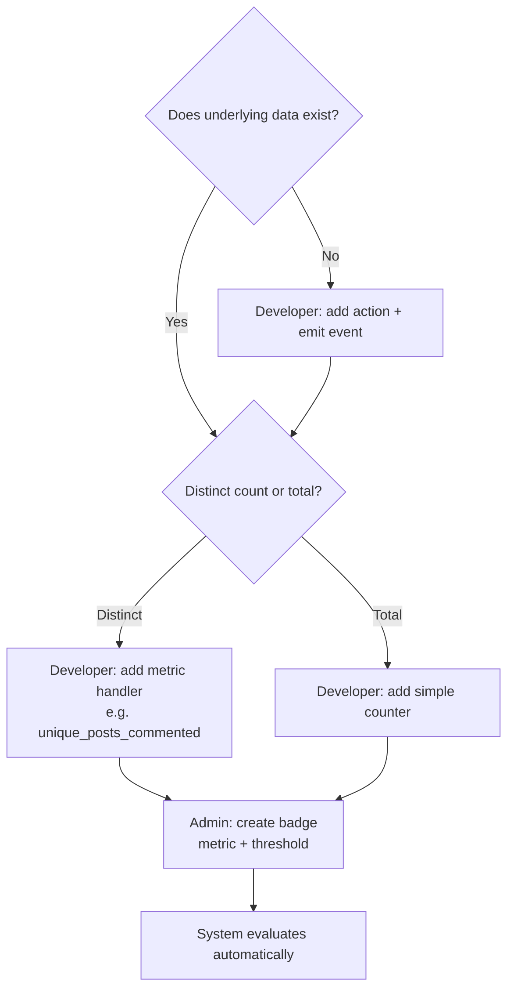

| Step | Who |
|------|-----|
| 1. Ensure action is emitted from API | Developer |
| 1b. If action can be undone (soft-delete), emit paired decrement action | Developer |
| 2. Register metric handler (+ decrement logic if applicable) | Developer |
| 3. Create badge + rule in admin UI | Admin |
| 4. Display progress | Automatic (generic UI) |

---

## Important Goals (Master Checklist)

Point-by-point targets for Platform Reviver — use as implementation checklist.

### Product goals

1. Keep the platform alive — users always have something to do beyond post and chat.
2. Admin can **turn gamification ON/OFF** globally; when OFF, all earning is frozen (progress kept, not deleted).
3. When ON, users earn **points**, **levels**, **badges**, and can **win events** in real time.
4. Admin dynamically configures badge images, descriptions, point values, level thresholds, and events — no deploy per threshold.
5. Developers own the **action catalog** and **metric handlers** in code; admin wires rewards to existing metrics.
6. Everything links to **`users.id`** — no username FK, no separate Gamification ID.
7. Rewards feel **instant** — no page refresh (API response + existing WebSocket).
8. **Rules and internals stay server-side** — client gets minimal display data only.

### Architecture goals

9. **One gamification hub** — `processUserAction()` is the only entry point; routes stay thin.
10. **Rule engine** — generic evaluator reads rules from DB; not hardcoded `if` per badge.
11. **Metric registry** — new goal = new `metric_key` handler, not a DB column per badge.
12. **Three reward layers** — permanent points/levels, permanent badges, time-boxed events/wins.
13. **Feature flag first** — when OFF, hub returns immediately (zero gamification D1 cost).
14. **Evaluate on write, not read** — badge checks on action, not every bootstrap/page load.
15. **Cached counters** — increment on action; decrement on soft-delete; avoid `COUNT(*)` on every action.
16. **Atomic hub writes** — `processUserAction` uses D1 `transaction()` so counters, ledger, and awards stay consistent.
17. **Concurrency-safe upserts** — composite PK on `(user_id, metric_key)` + `ON CONFLICT DO UPDATE`.
18. **Generic UI** — `BadgeGrid`, `GoalProgress`, `LevelBadge` driven by API; no component per badge.
19. **Passive rules** — follower count updates on the **followed** user, not the follower.
20. **Idempotent awards** — unique `(user_id, badge_id)`; never earn the same badge twice.
21. **Session-based streaks** — evaluate on `GET /api/me/bootstrap`, not `POST /login`.
22. **Gamification notification types** — `badge_award` and `level_up` (not generic `system`).
23. **Active-event cache** — 5-minute TTL in Worker memory; invalidate on admin event changes.

### Security & client exposure goals

24. **Server authoritative** — client never awards badges or points; only displays outcomes.
25. **No public rules API** — `badge_rules`, `point_rules`, `metric_key` names never sent to users.
26. **Minimal public DTO** — level, points, badge name/image, goal label + progress only.
27. **Piggyback on normal routes** — embed small `g` block in share/comment/bootstrap responses, not obvious `/api/gamification/rules`.
28. **Admin endpoints** — gamification CRUD admin-only (`role === 'admin'`).
29. **Do not rely on hiding Network tab** — obscurity is not security; minimize payload, not pretend invisibility.

### Cost & operations goals

30. **Design for Cloudflare free tier early** — 100 concurrent users is comfortable; 1,000 accounts with ~10–20% DAU is fine.
31. **Upgrade trigger** — move to Workers Paid ($5/mo) when consistently near 70K+ Worker requests or D1 writes per day.
32. **R2 for badges is negligible** — badge images are tiny vs post media.
33. **Ledger retention** — plan `points_ledger` archival/aggregation so D1 does not grow unbounded.
34. **Anti-abuse** — rate limits, unique-post logic, daily point caps to prevent farming.
35. **Notify on milestones** — toast/badge/level-up only when meaningful; not every +1 point (saves DO traffic).

### Event & wins goals

36. Admin can create **time-boxed events** — leaderboards, first-to-N, threshold, raffle.
37. Event progress only evaluated while event is **active** — cached list, not full table scan per action.
38. Event prizes — exclusive badge, bonus points, or title; recorded in `event_wins`.
39. Optional opt-in — user joins event before progress counts toward it.

### Instant delivery goals

40. **Path 1 (primary):** action API response includes gamification payload → React updates state immediately.
41. **Path 2 (secondary):** WebSocket `gamification_reward` or `system_toast` for toasts, bell, other tabs.
42. Reuse existing `RealtimeDO` + `broadcast-notification` — no new realtime infrastructure.
43. When gamification OFF — no gamification block in responses; UI hides or shows frozen state.

---

## Admin Master Toggle

Store in `system_settings` (existing pattern):

```text
gamification_enabled: true | false
```

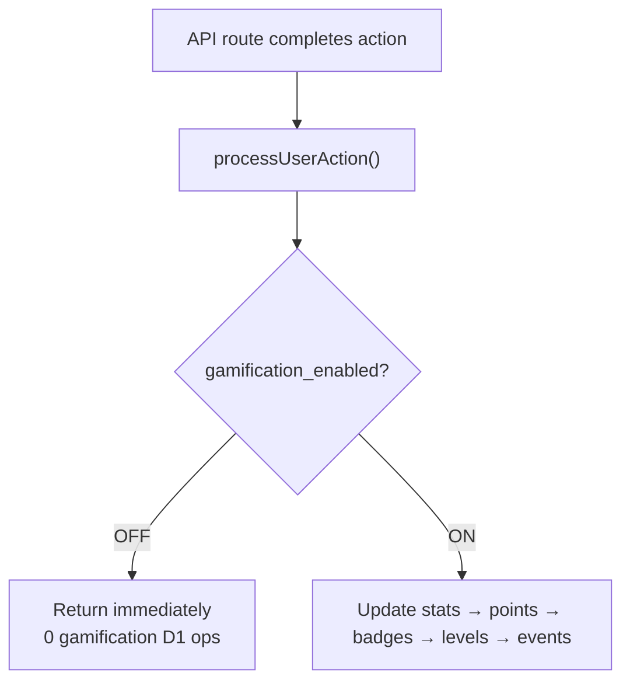

| State | Behavior |
|-------|----------|
| **OFF** | No counter updates, no points, no badge checks, no event progress, no ledger writes |
| **OFF** | Earned badges and frozen points/levels **remain visible** (read-only) |
| **ON** | Full hub pipeline runs; earning resumes from frozen totals |

---

## Three Reward Layers

| Layer | Lifetime | Admin configures | Example |
|-------|----------|------------------|---------|
| **Points + Levels** | Permanent | Point values, level table | Level 7 at 1,250 pts |
| **Badges** | Permanent (one-time) | Badge + rule (metric + threshold) | 100 unique shares |
| **Events / Wins** | Time-boxed | Start/end, win type, prizes | Comment Week top 5 |

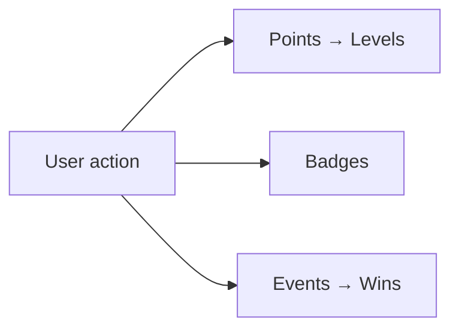

### Event win types (dev registers, admin configures)

| Type | How it works |
|------|--------------|
| **Leaderboard** | Top N by metric at `ends_at` |
| **First to N** | First X users hit threshold |
| **Threshold** | Everyone who hits goal during window |
| **Raffle** | Random draw from eligible participants |

---

## Rule Engine — What It Is and Why

**Not** AI, not admin-written SQL, not a separate microservice.

It is a **generic server-side evaluator** — written once:

```text
for each active badge_rule:
  if user_stat_counters[rule.metric_key] >= rule.threshold:
    award badge (idempotent)
```

| Without rule engine | With rule engine |
|---------------------|------------------|
| `if (shares >= 100) awardBadge()` in every route | One evaluator for all badges |
| New badge = code change + deploy | New badge = admin UI row |
| Inconsistent award logic | Single place for idempotency, on/off flag |

**Developers** register metrics (`unique_posts_commented`). **Admin** attaches rules. **Engine** connects them.

---

## Instant Delivery (No Page Refresh)

HIN already has WebSocket → `RealtimeDO` for notifications and `system_toast`.

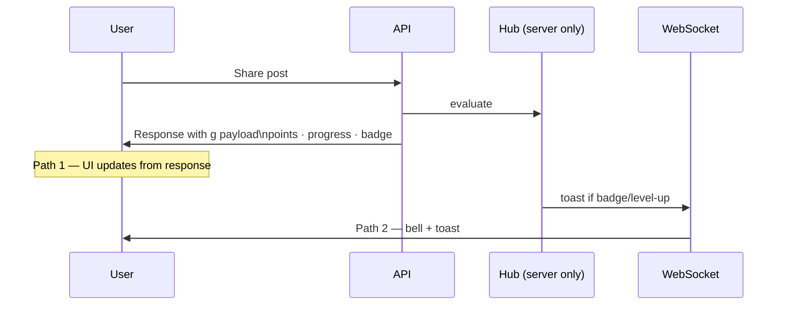

| What | How |
|------|-----|
| Points / level in header | API response → `setState` |
| Progress bar | API response |
| Badge earned toast | API response + WebSocket |
| Notification inbox | `broadcast-notification` with `type: 'badge_award'` / `'level_up'` (existing) |

---

## Client Exposure & Security Model

**Cannot hide outcomes from Network tab** if the UI shows them. **Can hide implementation.**

### Server only (never in client API/WebSocket)

- `badge_rules`, `point_rules`, `event_rules`, metric registry
- `metric_key` strings (`unique_posts_commented`, etc.)
- Action types (`post_shared`, `comment_created`)
- Thresholds and operators
- Rule engine logic
- Admin CRUD payloads

### Client may receive (minimal public DTO)

- `gamificationEnabled: boolean`
- `level`, `points` (or level only)
- Earned badges: `{ id, name, imageUrl }`
- Goals: `{ id, label, current, target }` or percent only
- Action response: `pointsEarned`, `badgesEarned` this action

### Why some sites look "hidden" in Network tab

| Appearance | Actual cause |
|------------|----------------|
| No XHR/Fetch data | SSR/RSC — data in Document or flight payload |
| Empty Preview | Binary/protobuf — still in Response tab |
| No JSON calls | WebSocket frames — check WS tab |
| Gibberish | Encoded/obfuscated — reversible, not secure |

**Real security = server authority + minimal DTO**, not empty Network tab.

---

## Cost & Cloudflare Capacity (HIN)

Stack: Workers + D1 + R2 + `RealtimeDO` (WebSocket).

### Free tier limits (daily unless noted)

| Resource | Free limit |
|----------|------------|
| Worker requests | 100,000 / day |
| D1 rows written | 100,000 / day |
| D1 rows read | 5,000,000 / day |
| DO requests | 100,000 / day |
| DO duration | 13,000 GB-s / day |
| R2 storage | 10 GB-month |

### Realistic capacity

| Scenario | Free tier? |
|----------|------------|
| ~100 users online at same time | **Yes — comfortable** |
| 1,000 registered accounts (~100–200 DAU) | **Yes** |
| 1,000 daily active users | **Borderline** — monitor dashboard |
| Gamification OFF | **Zero** extra gamification D1 cost |

### Gamification cost impact (when ON)

| Resource | Impact |
|----------|--------|
| R2 badge images | Negligible |
| Worker HTTP requests | None extra (same routes) |
| D1 writes per action | +4–8 writes |
| D1 reads per action | +15–40 reads |
| DO | Small (reuse notification path) |

### Cost-conscious design

- Feature flag OFF → hub no-op
- Increment counters, don't `COUNT(*)` every action
- Decrement counters on soft-delete / undo (paired actions)
- Evaluate on action, not page load
- Cache active events in Worker memory (5-min TTL); invalidate on admin CRUD
- Cap ledger detail; aggregate monthly
- Milestone toasts only (not every +1 pt)

**Upgrade to Workers Paid ($5/mo)** when consistently near 70K+ requests or D1 writes/day.

---

## What Exists in HIN Today

See [Prerequisites](#prerequisites-before-starting) for the full pre-v1 checklist and misconception table.

| Area | Status |
|------|--------|
| `users.id` identity | ✅ Used everywhere |
| Admin panel + role guard | ✅ `AdminDashboard`, `/api/admin` |
| Image upload to R2 | ✅ Extend with `badge` type |
| `post_shares`, `user_follows`, `comments` | ✅ Ready for metrics |
| JWT in localStorage (SPA auth) | ✅ Exists — streaks must use bootstrap, not `POST /login` |
| Browser sessionStorage / location tracking | ➖ Not used for gamification — not required |
| User timezone preference | ❌ Not yet — optional for v3 streak calendar days (default UTC) |
| Login streak / activity tracking | ❌ Not yet — needs `user_streaks` + **bootstrap hook** (v3) |
| Session duration (`session_tick`) | ❌ Not yet — heartbeat route in v4 |
| Gamification tables | ❌ Not yet — greenfield (v1) |
| Notifications | ✅ Extend with `badge_award`, `level_up` types |
| `GET /api/me/bootstrap` | ✅ Exists — add `session_active` + gamification `g` block when ON |

---

## Summary

**Platform Reviver** is a unified gamification layer on top of existing social actions:

1. **Users** always have goals, progress, points, levels, badges, and events — reasons to come back.
2. **Admin** toggles the feature ON/OFF and configures the economy without per-badge deploys.
3. **Developers** extend the action/metric catalog; hub, rule engine, and evaluator stay stable.
4. **Everything links to `users.id`** — one identity, no separate Gamification ID.
5. **Instant feedback** — API response + WebSocket; no page refresh.
6. **Server-only rules** — minimal client DTO; Network tab obscurity is not security.
7. **Cost-aware** — feature flag, counters on write (+ decrement on delete), transactions, free tier fine for ~100 concurrent / 1K accounts.
8. **Production hardening** — bootstrap streaks, atomic hub transactions, concurrency-safe upserts, typed notifications, event cache.

Ship **v1** with gamification OFF, then enable in **v2**. Each new badge or metric is a registry plugin — not a rewrite.

See **Prerequisites** for what must exist before v1, common misconceptions (localStorage vs server tracking), and the copy-paste checklist.

See **Starter Pack, Actions & Naming** for launch badges, programmed actions, and dev vs admin display names.

See **Implementation Plan (v1 → v4)** and **Phase granularity (4 vs 6 vs 8)** for rollout scope; use optional v2a/v2b splits only if a phase is too large for one PR.

See **Agent Handoff** sections after each phase for build order, verification, and handoff between Cursor sessions.

See **Important Goals (Master Checklist)** for the full 43-point target list.

---

**Related:** Interactive architecture diagrams → [`platformreviver.html`](./platformreviver.html)

*Living document — July 2026. Prerequisites, v1–v4 plan (+ optional 6-phase split), starter badge pack, agent handoffs, actions & naming, cost model, rule engine, instant delivery, security.*
