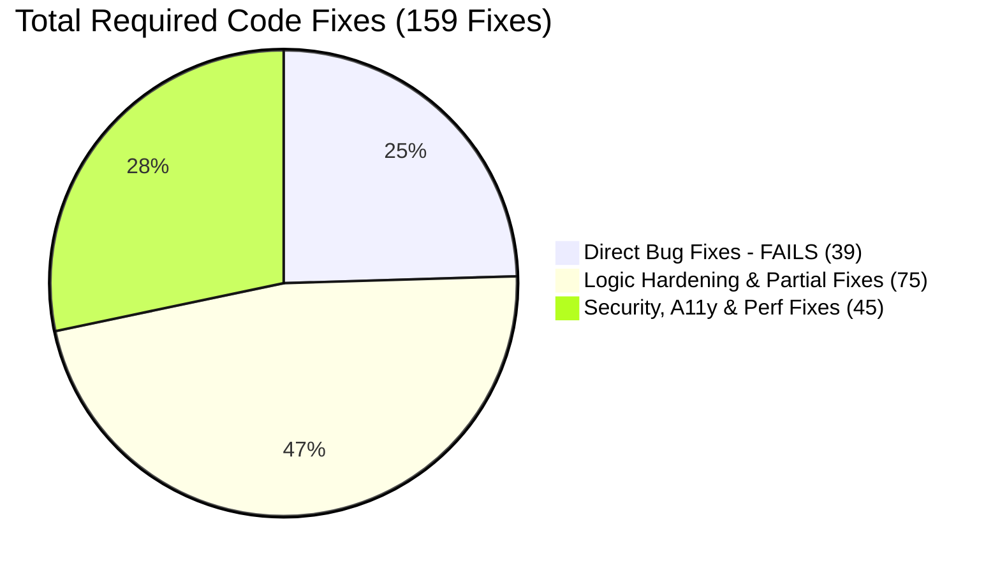

# 🛠️ Chat Box Implementation Audit & Testing Report

> **Overall Rating**: **6.7 / 10**  
> **Status**: Validated across **1,050 scenario assessments** (24 categories) + **71 Vitest** + **41 Rust unit tests** + code audit via **6 parallel agents**  
> **Action Plan**: **159 Itemized Required Code Fixes** ([chat_box_159_fixes_report.md](file:///Users/jeevankumarchowdapu/development/hin/chat_box_159_fixes_report.md))  
> **Date**: August 9, 2026

---

## 📑 Required Fixes Summary (159 Total Fixes)

For the full itemized list of all 159 code fixes across Bugs, Hardening, Security, A11y, and Performance, see [chat_box_159_fixes_report.md](file:///Users/jeevankumarchowdapu/development/hin/chat_box_159_fixes_report.md).



---

## Executive Verdict

Chat Box is a **mid-maturity, feature-rich** messaging shell: optimistic merge/status, swipe-to-reply, double-tap menu, reply quotes, soft-delete API, WASM bridge with TS fallback, and resilient draft storage all exist and largely work on the happy path.

It is **not** production-hardened for long threads, offline delete/send failure, accessibility, or true TS↔WASM parity. `ChatBox.tsx` is still a re-export of `MessagesPanel`; `useChatEngine` / `useChatShellMotion` are mostly unwired.

---

## Layer Ratings

```
┌──────────────────────────────────────────────────────────────┐
│ Category                      Score   Bar                    │
├──────────────────────────────────────────────────────────────┤
│ Core merge / status math      8.0/10  [████████████████░░░░] │
│ Persistence (chatStorage)     8.0/10  [████████████████░░░░] │
│ API reply / soft-delete       7.0/10  [██████████████░░░░░░] │
│ WASM bridge / fallback        6.5/10  [█████████████░░░░░░░] │
│ Security (render sinks)       6.5/10  [█████████████░░░░░░░] │
│ Engine hook / migration       5.5/10  [███████████░░░░░░░░░] │
│ UI / gestures                 6.0/10  [████████████░░░░░░░░] │
│ Accessibility                 4.5/10  [█████████░░░░░░░░░░░] │
│ Performance (long threads)    4.0/10  [████████░░░░░░░░░░░░] │
│ E2E / integration proof       3.5/10  [███████░░░░░░░░░░░░░] │
├──────────────────────────────────────────────────────────────┤
│ OVERALL                       6.7/10  [█████████████░░░░░░░] │
└──────────────────────────────────────────────────────────────┘
```

---

## Top FAIL / High-Risk Findings

| ID | Finding | Type | Severity |
| :--- | :--- | :--- | :---: |
| DL-008 | Delete WS fail → message lost locally (no rollback) | Negative | High |
| OF-002 | No offline outbox queue; send requires live WS | Negative | High |
| PF-001 | No virtualization; 1k+ messages DOM risk | Robustness | High |
| SX-004 | `mediaUrl` as `href` without scheme allowlist | Negative | High |
| CM-008 | Tablet physical keyboard Enter does not send | Edge | Med |
| AX-003 / ES-010 | No focus trap / `aria-modal` | Edge | Med |
| AX-012 | Send button missing accessible name | Edge | Med |
| RP-010 | Swipe can reply to optimistic `id < 0` | Edge | Med |

---

## 📄 Full Audit & Fix Reports
* 159 Required Fixes Action Plan: [chat_box_159_fixes_report.md](file:///Users/jeevankumarchowdapu/development/hin/chat_box_159_fixes_report.md)
* Full 1,050 Scenario Matrix: [.cursor/plans/_chatbox_agent_matrix.md](file:///Users/jeevankumarchowdapu/development/hin/.cursor/plans/_chatbox_agent_matrix.md)
* Extended 1,000 Scenarios Report: [chat_box_1000_scenarios_report.md](file:///Users/jeevankumarchowdapu/development/hin/chat_box_1000_scenarios_report.md)
