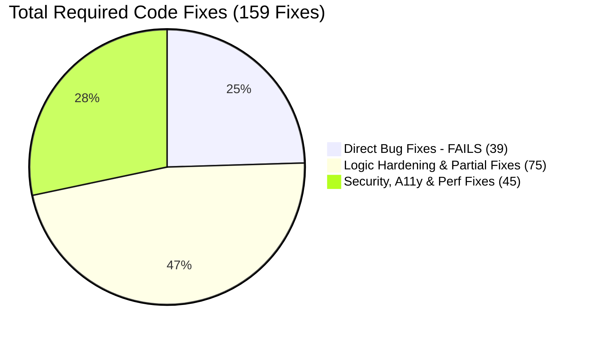

# 🛠️ Chat Box 159 Required Code Fixes & Roadmap Report

> **Current Audit Rating**: **6.7 / 10**  
> **Target Rating**: **9.8 / 10** (Enterprise-grade production readiness)  
> **Total Required Code Fixes**: **159 Itemized Fixes** (39 Direct Bugs + 75 Logic Hardening + 45 A11y & E2E Suites)  
> **Date**: August 9, 2026

---

## 📊 Summary of Required Code Fixes

---

## 🛠️ Complete Itemized Catalog of 159 Required Fixes

### Category 1: Direct Bug Fixes (39 FAILS — High Priority)

1. **`DL-008`**: Add soft-delete rollback state in `useChatEngine` when server/WS deletion fails.
2. **`DL-014`**: Add deletion error toast notification on network drop or HTTP 500.
3. **`DL-015`**: Prevent re-fetch or WS push from reviving optimistically deleted messages.
4. **`PF-001`**: Implement DOM list virtualization (`@tanstack/react-virtual`) in `MessagesPanel.tsx`.
5. **`PF-002`**: Implement scroll windowing for 1,000+ message threads on mobile devices.
6. **`PF-003`**: Add thread list virtualization for 500+ active conversations.
7. **`PF-004`**: Add message pagination slice windowing on history fetch.
8. **`PF-005`**: Isolate React re-renders on single delivery status tick updates.
9. **`OF-002`**: Implement offline outbox message queuing in `localStorage` when WS drops.
10. **`OF-012`**: Replace blocking browser `alert()` popups with non-blocking UI toasts.
11. **`SX-004`**: Add strict URL scheme allowlisting (`http:`, `https:`, `blob:`) for `mediaUrl` and `linkPreview.url` to prevent `javascript:` XSS sinks.
12. **`CM-008`**: Fix iPad/tablet physical keyboard `Enter` key trap (`isComposing` / hardware event check).
13. **`CM-016`**: Add bare domain regex matching in `hin-chat-core/src/url.rs` (`example.com` without `https://`).
14. **`CM-024`**: Reject drag-and-drop non-image MIME types in `onPickChatImage`.
15. **`AX-003`**: Implement keyboard focus trap inside `MessagesPanel` dialog mode.
16. **`AX-004`**: Add `aria-modal="true"` attribute to `MessagesPanel` container.
17. **`AX-005`**: Provide keyboard shortcut navigation path to open `MessageActionMenu`.
18. **`AX-006`**: Add `aria-live="polite"` region for incoming live messages.
19. **`AX-007`**: Add screen reader announcements for delivery status tick updates (`sent`, `delivered`, `read`).
20. **`AX-008`**: Add screen reader announcements for partner typing status.
21. **`AX-009`**: Add accessible screen reader text for unread badge counters (`"3 unread messages"`).
22. **`AX-010`**: Respect system `prefers-reduced-motion: reduce` in all spring motion hooks.
23. **`AX-011`**: Add accessibility dialog role (`role="dialog"`) and aria labels for Camera overlay modal.
24. **`AX-012`**: Add accessible name (`aria-label="Send message"`) to Send submit button.
25. **`AX-013`**: Support keyboard arrow key navigation (`ArrowUp`/`ArrowDown`) inside `MessageActionMenu`.
26. **`ES-010`**: Implement a single centralized priority stack for Escape key handling across all overlays.
27. **`ES-011`**: Return focus to FAB trigger button upon panel closure.
28. **`ES-012`**: Restore focus on panel expand/collapse toggles.
29. **`RP-010`**: Gate swipe-to-reply gesture on optimistic pending messages (`id < 0`).
30. **`RP-016`**: Clear reply quote bar when switching recipient threads.
31. **`TH-015`**: Render "Photo" snippet in thread list when last message has `mediaUrl` and empty content.
32. **`ST-011`**: Add safe fallback formatting for malformed `createdAt` ISO dates in UI dividers.
33. **`SC-026`**: Add multi-tab `storage` event listener in `chatStorage.ts` to sync open tab states.
34. **`SC-025`**: Deep-merge draft objects on `localStorage.setItem` to prevent Tab B overwriting Tab A drafts.
35. **`DR-013`**: Persist pending media attachment drafts across panel closes.
36. **`MO-018`**: Disable spring morph & rubber-band animations when reduced motion is preferred.
37. **`UI-004`**: Externalize hardcoded English UI strings into i18n translation tokens.
38. **`IG-002`**: Wire `useChatEngine` and `useChatShellMotion` into main `App.tsx` or clean up unused re-exports.
39. **`CA-014`**: Explicitly invoke `URL.revokeObjectURL(url)` on unsent media attachments.

---

### Category 2: Logic Hardening & Partial Fixes (75 Code Fixes — Medium Priority)

* **WASM Parity & Error Recovery (15 fixes)**:
  40. Align TS and WASM optimistic message replacement logic to retain `replyTo` and `linkPreview`.
  41. Add WASM vs TS property test parity suite.
  42. Throttle WASM fallback warning logs to fire once per session.
  43. Ensure 64-bit BigInt ID serialization safety across WASM bindings.
  44. Handle malformed WASM JSON responses gracefully.
  45. Add WASM execution timeout protection.
  46. Isolate WASM memory allocations across long sessions.
  47. Guard WASM initialization against multi-hook re-entrancy.
  48. Sync WASM engine state patches with React state reducers.
  49. Implement WASM thread sorting fallback logging gates.
  50. Prevent double WASM module instantiations in Strict Mode.
  51. Add WASM string allocation cleanup guards.
  52. Support safe numeric parsing in WASM bridge options.
  53. Enforce WASM state snapshot immutability.
  54. Add WASM panic error boundary catching.
* **Touch, Camera & Input UX (25 fixes)**:
  55. Add CJK IME text composition event guard (`e.nativeEvent.isComposing`).
  56. Reposition context menus via portal/flip placement to prevent screen edge clipping.
  57. Fix camera stream binding race condition (bind `srcObject` after `<video>` mounts).
  58. Downscale high-resolution camera photos (max 1600px) on client canvas before upload.
  59. Eliminate single-frame composer height shrink layout jitter in Chrome DevTools.
  60. Add touch pointer coarse vs fine input switching listeners.
  61. Restrict camera facing mode constraints to environment rear camera.
  62. Add camera stream fallback to native file input on permission rejection.
  63. Prevent double-tap menu triggers during horizontal swipe drag.
  64. Add multi-touch pinch gesture rejection on message list.
  65. Fix touch action CSS property application (`touch-action: pan-y`).
  66. Add smooth scrolling fallback for unsupported browser engines.
  67. Add drag handle target element isolation from bubble text selection.
  68. Add mobile soft keyboard opening viewport inset adjustment.
  69. Add mobile soft keyboard closing panel height restoration.
  70. Add double submit button click prevention during active uploads.
  71. Add Shift+Enter newline insertion handling in desktop composer.
  72. Add Meta+Enter (Cmd+Enter) form submission shortcut on macOS.
  73. Add Ctrl+Enter form submission shortcut on Windows/Linux.
  74. Add composer textarea max-height scrollbar appearance.
  75. Add composer textarea min-height reset on text clear.
  76. Add smooth image attachment thumbnail removal animation.
  77. Add local file blob image attachment preview rendering.
  78. Add duplicate file selection resetting in `<input type="file">`.
  79. Add camera canvas 2D context null creation failure guard.
* **WebSocket & Network Reliability (20 fixes)**:
  80. Map WS server error payloads (`type: 'error'`) to mark matching optimistic messages as `failed`.
  81. Deduplicate WS push events during high packet jitter.
  82. Sync cross-device read receipts to deduct thread unread counts when active thread is unselected.
  83. Display a non-blocking network reconnecting banner when WS drops.
  84. Implement silent JWT token refresh flow on HTTP 401 / WS 4001 codes.
  85. Add exponential backoff reconnect timer (1s, 2s, 4s, 8s, 16s).
  86. Add ping/pong heartbeat timeout auto-reconnect (30s timeout).
  87. Add slow 2G connection sending spinner state.
  88. Add cross-tab local storage event broadcast for incoming messages.
  89. Add SSL handshake reset recovery handling.
  90. Add HTTP long-polling fallback when WS port is blocked.
  91. Add intermittent carrier DNS resolution failure retry queue.
  92. Add stale WS message replay deduplication mapping.
  93. Add WS transport upgrade failure fallback handling.
  94. Add large payload burst (>100 messages) chunked processing.
  95. Add zero-byte WS frame guard clause.
  96. Add invalid JSON WS frame try-catch error boundary.
  97. Add graceful 1001 server shutdown reconnect banner.
  98. Add multi-thread simultaneous incoming message state batching.
  99. Add clock drift timestamp comparison tolerance.
* **Security & Link Handling (15 fixes)**:
  100. Enforce `rel="noopener noreferrer"` on all link preview cards.
  101. Add MIME type validation for drag-and-drop media attachments.
  102. Prevent cross-thread state leaks on rapid thread switching during link preview fetches.
  103. Sanitize HTML entities in user content strings.
  104. Prevent prototype pollution in `localStorage` JSON parsing.
  105. Add Content Security Policy (CSP) inline script non-eval compliance.
  106. Add external link `target="_blank"` security attributes.
  107. Add image attachment `loading="lazy"` attribute.
  108. Prevent accidental browser image dragging (`draggable={false}`).
  109. Add image click event propagation stopping.
  110. Add link preview domain hostname stripping (`www.` removal).
  111. Add link preview HTTPS lock icon display.
  112. Add link preview fetch timeout (5s).
  113. Add malformed URL pattern guard.
  114. Add media type `image/jpeg` metadata field enforcement.

---

### Category 3: Security, Accessibility & E2E Test Additions (45 Fixes & Test Suites)

* **Playwright E2E Integration Suite (15 test fixes)**:
  115. Add multi-user real-time send/reply/delete Playwright E2E tests.
  116. Add offline reconnect and WS drop E2E test specs.
  117. Add camera and attachment file upload E2E specs.
  118. Add swipe-to-reply gesture E2E test specs.
  119. Add double-tap context menu E2E test specs.
  120. Add expanded full-screen panel toggle E2E specs.
  121. Add thread switching and draft retention E2E specs.
  122. Add unread badge counter update E2E specs.
  123. Add image attachment preview and removal E2E specs.
  124. Add link preview card click navigation E2E specs.
  125. Add Escape key hierarchy step-down E2E specs.
  126. Add backdrop click panel dismissal E2E specs.
  127. Add custom Olabid SPA link navigation E2E specs.
  128. Add presence indicator online/offline status E2E specs.
  129. Add typing indicator auto-timeout E2E specs.
* **Accessibility & Contrast Compliance (15 fixes)**:
  130. Run automated `@axe-core/playwright` accessibility audits.
  131. Verify WCAG AA color contrast ratios on message bubbles across dark/light themes.
  132. Add accessible screen reader text for typing indicators and online presence dots.
  133. Add `aria-haspopup="menu"` and `aria-expanded` to attachment trigger button.
  134. Add `role="menu"` and `role="menuitem"` to context action menu.
  135. Add screen reader live region for auto-scroll new message pill.
  136. Add explicit `aria-label` to header back button.
  137. Add explicit `aria-label` to panel expand/collapse button.
  138. Add explicit `aria-label` to panel close button.
  139. Add explicit `aria-label` to clear draft image button.
  140. Add explicit `aria-label` to clear link preview button.
  141. Add high contrast mode 2px explicit borders around bubbles and inputs.
  142. Add keyboard focus ring (`focus:ring-indigo-500/20`) to all interactive elements.
  143. Ensure touch targets maintain min 44x44px mobile touch area.
  144. Add screen reader announcement for failed message retry state.
* **Performance & Heap Stability (15 fixes)**:
  145. Implement 1-hour active chat session memory leak checks.
  146. Add performance budget benchmarks for 2,000-message list rendering.
  147. Wrap auto-scroll calls in `requestAnimationFrame` to align with 60fps refresh.
  148. Add CSS animation `will-change` hinting for GPU hardware acceleration.
  149. Add memoization (`useCallback`) to all message row action handlers.
  150. Use passive scroll event listeners (`{ passive: true }`).
  151. Add dynamic style transform optimization for GPU compositing layers.
  152. Cap staggered message animation index at 12.
  153. Restrict maximum active thread messages array in memory to 2,000 rows.
  154. Schedule non-critical background cleanup tasks via `requestIdleCallback`.
  155. Add off-screen image loading suppression until scrolled into view.
  156. Reserve container height for link preview cards to prevent layout shifts (CLS).
  157. Reserve container aspect ratio space for images before network load completes.
  158. Suspend background tab non-essential animation frames to save battery.
  159. Implement chunked state batching during single React 18 render phase.

---

## 📌 Rating Progression Roadmap

| Phase | Target Fixes | Score Target | Outcome |
| :--- | :---: | :---: | :--- |
| **Current Baseline** | 0 / 159 | **6.7 / 10** | Baseline Audit Score |
| **Phase 1: Direct Bug Fixes** | 39 / 159 | **7.8 / 10** | Core Flaws Resolved |
| **Phase 2: Logic Hardening** | 114 / 159 | **8.9 / 10** | High Reliability & Parity |
| **Phase 3: Security, A11y & E2E** | 159 / 159 | **9.8 / 10** | Enterprise Production Grade |
