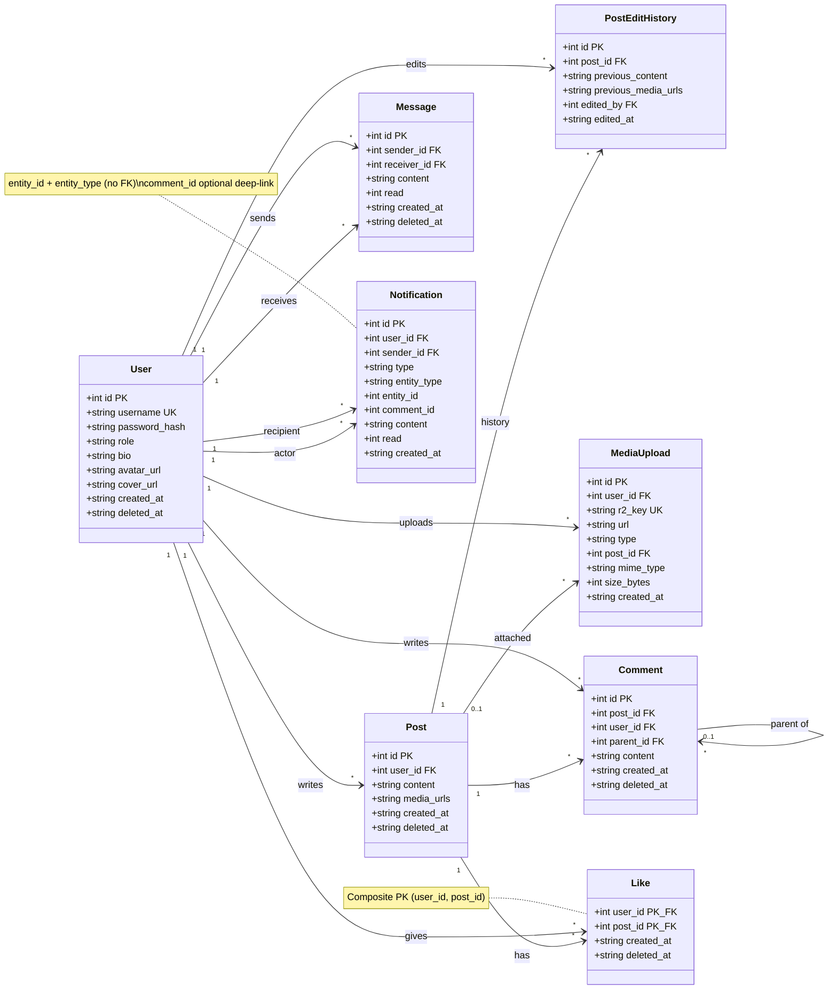
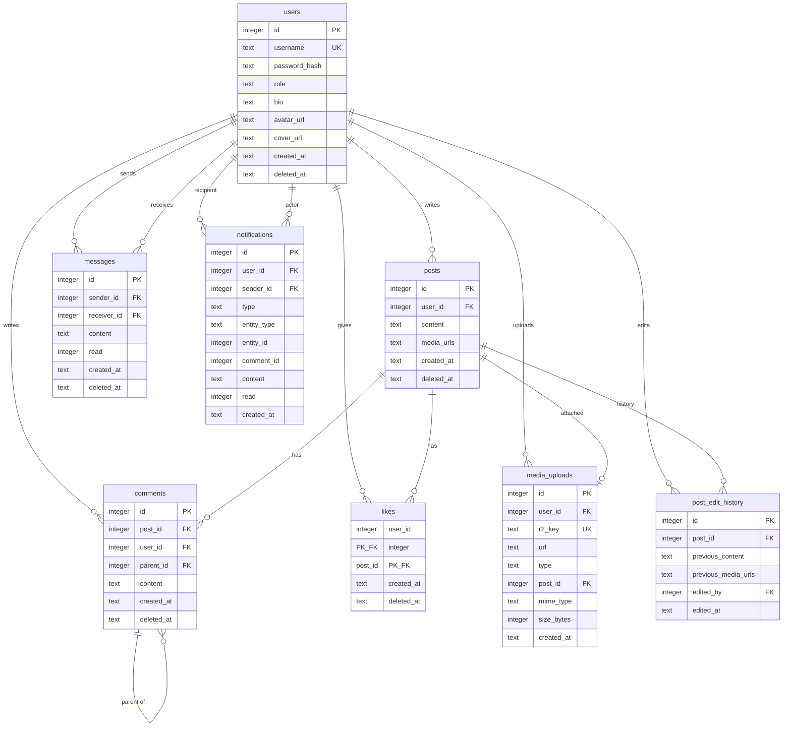

# Database Schema

Source of truth: [`src/schema.ts`](./src/schema.ts) (Drizzle ORM, SQLite / Cloudflare D1).

**Interactive diagrams:** open [`schema-uml.html`](./schema-uml.html) in a browser (UML class diagram + ER diagram, rendered with Mermaid).

Soft-deleted rows use a nullable `deleted_at` timestamp (`NULL` = active). Notifications do not soft-delete.

---

## UML Class Diagram

---

## Entity Relationship Diagram

### Relationship summary

| From | To | FK | On delete | Cardinality |
| --- | --- | --- | --- | --- |
| `posts.user_id` | `users.id` | author | cascade | many posts → one user |
| `post_edit_history.post_id` | `posts.id` | edited post | cascade | many history rows → one post |
| `post_edit_history.edited_by` | `users.id` | editor | cascade | many history rows → one user |
| `media_uploads.user_id` | `users.id` | uploader | cascade | many uploads → one user |
| `media_uploads.post_id` | `posts.id` | optional post | set null | many uploads → zero/one post |
| `comments.post_id` | `posts.id` | post | cascade | many comments → one post |
| `comments.user_id` | `users.id` | author | cascade | many comments → one user |
| `comments.parent_id` | `comments.id` | parent comment | cascade | self-referential nesting |
| `likes.user_id` | `users.id` | liker | cascade | composite PK |
| `likes.post_id` | `posts.id` | liked post | cascade | composite PK |
| `messages.sender_id` | `users.id` | sender | cascade | many messages → one user |
| `messages.receiver_id` | `users.id` | receiver | cascade | many messages → one user |
| `notifications.user_id` | `users.id` | recipient | cascade | many notifications → one user |
| `notifications.sender_id` | `users.id` | actor | cascade | many notifications → one user |

`notifications.entity_id` is interpreted via `entity_type` (`post` or `message`) and is **not** enforced as a foreign key. Optional `comment_id` deep-links comment / mention-in-comment notifications without changing `entity_id` semantics.

---

## Tables

### `users`

Account profiles.

| Column | Type | Constraints | Notes |
| --- | --- | --- | --- |
| `id` | integer | PK, autoincrement | |
| `username` | text | not null, unique | |
| `password_hash` | text | not null, default `''` | |
| `role` | text | not null, default `'user'` | |
| `bio` | text | nullable | |
| `avatar_url` | text | nullable | |
| `cover_url` | text | nullable | |
| `is_private` | integer | not null, default `0` | `0` = public, `1` = private |
| `created_at` | text | not null, default `CURRENT_TIMESTAMP` | |
| `deleted_at` | text | nullable | soft delete |

**Indexes:** `users_deleted_at_idx` (`deleted_at`), `users_is_private_idx` (`is_private`)

**Evolution notes:** `is_private` added in migration `0015`. Existing rows default to public (`0`).

---

### `posts`

Feed posts authored by users.

| Column | Type | Constraints | Notes |
| --- | --- | --- | --- |
| `id` | integer | PK, autoincrement | |
| `user_id` | integer | not null, FK → `users.id` | cascade on delete |
| `type` | text | not null, default `'text'` | `'text'` \| `'poll'` — extensible post kind |
| `content` | text | not null | |
| `media_urls` | text | nullable | JSON array of media URLs (max 5) |
| `visibility` | text | not null, default `'public'` | `'public'` \| `'followers'` \| `'only_me'` |
| `created_at` | text | not null, default `CURRENT_TIMESTAMP` | |
| `deleted_at` | text | nullable | soft delete |

**Indexes:** `posts_user_id_idx`, `posts_created_at_idx`, `posts_deleted_at_idx`, `posts_type_idx`, `posts_visibility_idx`

**Evolution notes:** `type` added in migration `0012`. Existing rows backfilled to `'text'`. `visibility` added in migration `0016`. Existing rows default to `'public'`.

---

### `post_edit_history`

Snapshots of post content before an edit.

| Column | Type | Constraints | Notes |
| --- | --- | --- | --- |
| `id` | integer | PK, autoincrement | |
| `post_id` | integer | not null, FK → `posts.id` | cascade on delete |
| `previous_content` | text | not null | content before edit |
| `previous_media_urls` | text | nullable | JSON array of previous media URLs |
| `edited_by` | integer | not null, FK → `users.id` | cascade on delete |
| `edited_at` | text | not null, default `CURRENT_TIMESTAMP` | |

**Indexes:** `post_edit_history_post_id_idx`, `post_edit_history_edited_at_idx`

---

### `media_uploads`

Tracked R2 uploads (avatars, covers, post media).

| Column | Type | Constraints | Notes |
| --- | --- | --- | --- |
| `id` | integer | PK, autoincrement | |
| `user_id` | integer | not null, FK → `users.id` | cascade on delete |
| `r2_key` | text | not null, unique | object key in R2 |
| `url` | text | not null | public URL |
| `type` | text | not null | `'avatar'` \| `'cover'` \| `'post'` |
| `post_id` | integer | nullable, FK → `posts.id` | set null on post delete |
| `mime_type` | text | not null | |
| `size_bytes` | integer | not null | |
| `created_at` | text | not null, default `CURRENT_TIMESTAMP` | |

**Indexes:** `media_uploads_user_id_idx`, `media_uploads_post_id_idx`, `media_uploads_type_idx`

---

### `comments`

Comments on posts, with optional nesting via `parent_id`.

| Column | Type | Constraints | Notes |
| --- | --- | --- | --- |
| `id` | integer | PK, autoincrement | |
| `post_id` | integer | not null, FK → `posts.id` | cascade on delete |
| `user_id` | integer | not null, FK → `users.id` | cascade on delete |
| `parent_id` | integer | nullable, FK → `comments.id` | self-reference; cascade on delete |
| `content` | text | not null | |
| `created_at` | text | not null, default `CURRENT_TIMESTAMP` | |
| `deleted_at` | text | nullable | soft delete |

**Indexes:** `comments_post_id_idx`, `comments_parent_id_idx`, `comments_user_id_idx`, `comments_deleted_at_idx`

---

### `comment_likes`

One like per user per comment (composite primary key).

| Column | Type | Constraints | Notes |
| --- | --- | --- | --- |
| `user_id` | integer | PK, FK → `users.id` | cascade on delete |
| `comment_id` | integer | PK, FK → `comments.id` | cascade on delete |
| `created_at` | text | not null, default `CURRENT_TIMESTAMP` | |
| `deleted_at` | text | nullable | soft delete (unlike) |

**Primary key:** (`user_id`, `comment_id`)

**Indexes:** `comment_likes_comment_id_idx`, `comment_likes_deleted_at_idx`

---

### `user_follows`

Accepted follow relationships (follower → following).

| Column | Type | Constraints | Notes |
| --- | --- | --- | --- |
| `follower_id` | integer | PK, FK → `users.id` | cascade on delete |
| `following_id` | integer | PK, FK → `users.id` | cascade on delete |
| `created_at` | text | not null, default `CURRENT_TIMESTAMP` | |
| `deleted_at` | text | nullable | soft delete (unfollow) |

**Primary key:** (`follower_id`, `following_id`)

**Indexes:** `user_follows_following_id_idx`, `user_follows_deleted_at_idx`

---

### `follow_requests`

Pending follow requests for private accounts.

| Column | Type | Constraints | Notes |
| --- | --- | --- | --- |
| `requester_id` | integer | PK, FK → `users.id` | cascade on delete |
| `target_id` | integer | PK, FK → `users.id` | cascade on delete |
| `created_at` | text | not null, default `CURRENT_TIMESTAMP` | |
| `deleted_at` | text | nullable | null = pending; set on approve/reject/cancel |

**Primary key:** (`requester_id`, `target_id`)

**Indexes:** `follow_requests_target_id_idx`, `follow_requests_deleted_at_idx`

---

### `likes`

One like per user per post (composite primary key).

| Column | Type | Constraints | Notes |
| --- | --- | --- | --- |
| `user_id` | integer | PK, FK → `users.id` | cascade on delete |
| `post_id` | integer | PK, FK → `posts.id` | cascade on delete |
| `created_at` | text | not null, default `CURRENT_TIMESTAMP` | |
| `deleted_at` | text | nullable | soft delete (unlike) |

**Primary key:** (`user_id`, `post_id`)

**Indexes:** `likes_post_id_idx`, `likes_deleted_at_idx`

---

### `messages`

Direct messages between users.

| Column | Type | Constraints | Notes |
| --- | --- | --- | --- |
| `id` | integer | PK, autoincrement | |
| `sender_id` | integer | not null, FK → `users.id` | cascade on delete |
| `receiver_id` | integer | not null, FK → `users.id` | cascade on delete |
| `content` | text | not null | |
| `read` | integer | not null, default `0` | `0` = unread, `1` = read |
| `created_at` | text | not null, default `CURRENT_TIMESTAMP` | |
| `deleted_at` | text | nullable | soft delete |

**Indexes:** `messages_sender_id_idx`, `messages_receiver_id_idx`, `messages_deleted_at_idx`

---

### `notifications`

In-app notifications for likes, comments, messages, mentions, and system broadcasts.

| Column | Type | Constraints | Notes |
| --- | --- | --- | --- |
| `id` | integer | PK, autoincrement | |
| `user_id` | integer | not null, FK → `users.id` | recipient; cascade on delete |
| `sender_id` | integer | not null, FK → `users.id` | actor; cascade on delete |
| `type` | text | not null | `'like'` \| `'comment'` \| `'message'` \| `'mention'` \| `'system'` \| `'follow'` \| `'follow_request'` \| `'follow_accepted'` |
| `entity_type` | text | nullable | `'post'` \| `'message'` \| `'system'` \| `'user'` — what `entity_id` points at |
| `entity_id` | integer | not null | post id, message id, or `system_broadcasts.id` (no FK) |
| `comment_id` | integer | nullable | optional deep-link for comment / mention-in-comment (no FK) |
| `content` | text | not null | display text |
| `read` | integer | not null, default `0` | `0` = unread, `1` = read |
| `created_at` | text | not null, default `CURRENT_TIMESTAMP` | |

**Indexes:** `notifications_user_id_idx`, `notifications_created_at_idx`, `notifications_user_id_read_idx` (`user_id`, `read`)

**Evolution notes:** `entity_type` and `comment_id` are additive (migration `0009`). Older rows may have `entity_type` backfilled and `comment_id` null.

---

### `system_broadcasts`

Admin audit log for every system message broadcast (notification, toast, or both). Always written, including toast-only sends.

| Column | Type | Constraints | Notes |
| --- | --- | --- | --- |
| `id` | integer | PK, autoincrement | referenced by `notifications.entity_id` when `entity_type = 'system'` |
| `sender_id` | integer | not null, FK → `users.id` | admin who sent it; cascade on delete |
| `content` | text | not null | message body |
| `delivery` | text | not null | `'notification'` \| `'toast'` \| `'both'` |
| `notifications_created` | integer | not null, default `0` | inbox rows created (0 for toast-only) |
| `created_at` | text | not null, default `CURRENT_TIMESTAMP` | |

**Indexes:** `system_broadcasts_sender_id_idx`, `system_broadcasts_created_at_idx`

**Evolution notes:** added in migration `0011`.

---

### `polls`

Poll configuration linked 1:1 to a poll post (`posts.type = 'poll'`).

| Column | Type | Constraints | Notes |
| --- | --- | --- | --- |
| `id` | integer | PK, autoincrement | |
| `post_id` | integer | not null, unique, FK → `posts.id` | cascade on delete |
| `question` | text | not null | poll question or statement shown above options |
| `ends_at` | text | nullable | ISO timestamp; null = no auto-expiry |
| `max_selections` | integer | not null, default `1` | `1` = single choice; `>1` = multi-select cap |
| `allow_vote_change` | integer | not null, default `1` | SQLite boolean - allow changing selection |
| `allow_vote_retraction` | integer | not null, default `1` | SQLite boolean - allow removing vote entirely |
| `is_anonymous` | integer | not null, default `0` | hide voter identities in API |
| `results_visibility` | text | not null, default `'always'` | `'always'` \| `'after_vote'` \| `'after_close'` |
| `status` | text | not null, default `'open'` | `'open'` \| `'closed'` |
| `total_votes` | integer | not null, default `0` | denormalized distinct voter count |
| `created_at` | text | not null, default `CURRENT_TIMESTAMP` | |

**Indexes:** `polls_post_id_idx`, `polls_status_idx`, `polls_ends_at_idx`

---

### `poll_options`

Choices for a poll.

| Column | Type | Constraints | Notes |
| --- | --- | --- | --- |
| `id` | integer | PK, autoincrement | |
| `poll_id` | integer | not null, FK → `polls.id` | cascade on delete |
| `label` | text | not null | max 200 chars (API validation) |
| `position` | integer | not null | display order (0-based) |
| `vote_count` | integer | not null, default `0` | denormalized |
| `created_at` | text | not null, default `CURRENT_TIMESTAMP` | |
| `deleted_at` | text | nullable | reserved for future option edits |

**Indexes:** `poll_options_poll_id_idx`

---

### `poll_votes`

User votes on poll options. Composite PK supports multi-select.

| Column | Type | Constraints | Notes |
| --- | --- | --- | --- |
| `user_id` | integer | PK, FK → `users.id` | cascade on delete |
| `option_id` | integer | PK, FK → `poll_options.id` | cascade on delete |
| `poll_id` | integer | not null, FK → `polls.id` | denormalized for lookups |
| `created_at` | text | not null, default `CURRENT_TIMESTAMP` | |
| `deleted_at` | text | nullable | soft delete (vote change / retract) |

**Indexes:** `poll_votes_poll_id_idx`, `poll_votes_user_poll_idx`, `poll_votes_deleted_at_idx`

**Evolution notes:** poll tables added in migration `0012`.

---

## Permalinks and deep links

Post permalinks use integer primary keys — no extra column is required.

| Resource | URL pattern | API |
| --- | --- | --- |
| Post | `/post/{posts.id}` | `GET /api/posts/:id` |
| Comment anchor | `/post/{postId}#comment-{comments.id}` | `GET /api/posts/:id/comments` |

**Notification → URL mapping** (semantic fields on `notifications`, not stored URLs):

| `type` | `entity_type` | `entity_id` | `comment_id` | Resolves to |
| --- | --- | --- | --- | --- |
| `like`, `comment`, `mention` | `post` | post id | optional comment id | `/post/{entity_id}` or `#comment-{comment_id}` |
| `follow`, `follow_request`, `follow_accepted` | `user` | user id | — | profile (future `/profile/:id`) |
| `system` | `system` | broadcast id | — | inbox only |

**Future extension:** optional `posts.slug` for SEO-friendly URLs (e.g. `/post/my-title-abc123`) with numeric-id redirect; optional `posts.public_uuid` for non-enumerable share links.

---

## Quick reference

| Table | Purpose | Soft delete |
| --- | --- | --- |
| `users` | Accounts / profiles | yes |
| `posts` | Feed posts (text or poll) | yes |
| `polls` | Poll settings (1:1 with poll posts) | no |
| `poll_options` | Poll choices | soft delete on options |
| `poll_votes` | User votes on options | yes |
| `post_edit_history` | Post edit snapshots | no |
| `media_uploads` | R2 media tracking | no |
| `comments` | Post comments (nested) | yes |
| `likes` | Post likes | yes |
| `messages` | DMs | yes |
| `notifications` | Activity alerts | no |
| `system_broadcasts` | Admin broadcast audit log | no |
